<div style="text-align:center">
	
</div>
<center>
	<h2>
		VE370 Intro to Computer Organization
	</h2>
</center> 
<center>
	<h3>
		Project 2 Individual Report
	</h3>
</center>
<center>
   <h4>
       FA 2020
    </h4> 
</center>
------------------------------------------

|     Name      |   Stud. ID   |
| :-----------: | :----------: |
| Zhou Zhanpeng | 518021910594 |

-------------------------------

### Abstract

In this project, I used the modeling language `verilog` to implement the Single-Cycle Processor based on MIPS instruction set.  The single cycle processor supports multiple instructions, such as `lw`, `add`, `jump` and etc. In this report, I will firstly introduce my modeling and implementation of each component of the single cycle processor and how I combine them together to process multiple instructions, then, I will compare the simulated results of my single cycle processor and the theoretical results when processing the same set of instructions. Finally, verilog sources files and peer evaluation will be provided.

### Description

#### Overview

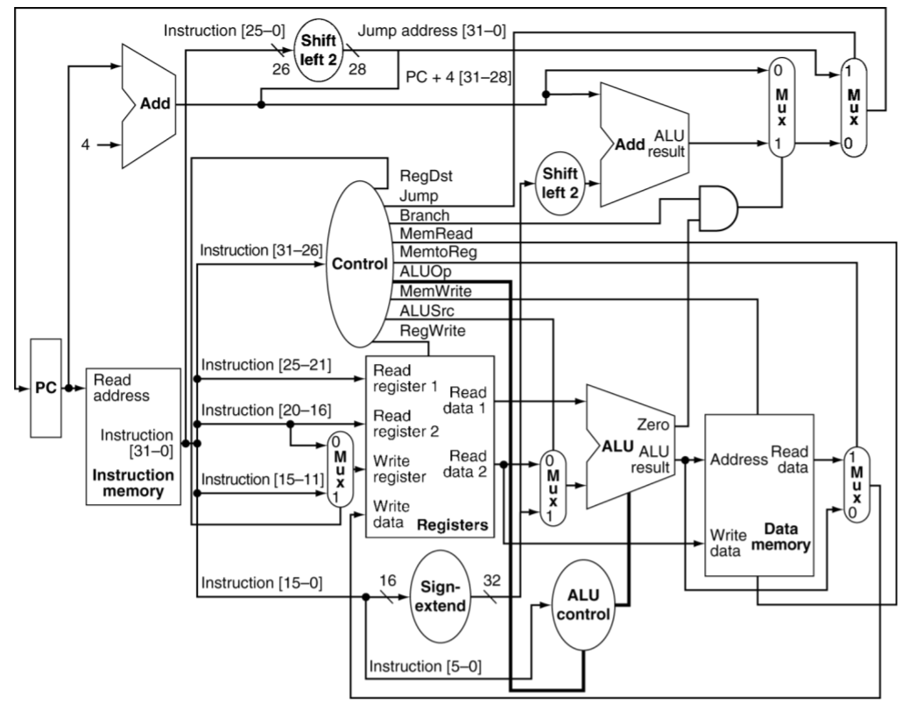

<center>
    <h6>
    Figure 1. Single cycle implementation of MIPS architecture
    </h6>
</center>

From a general point of view, my implementation and modeling basically follows above figure, where following instructions can be supported:

- The memory-reference instructions load word (`lw`) and store word (`sw`) 
- The arithmetic-logical instructions `add`, `addi`, `sub`, `and`, `andi`, `or`, and `slt` 
- The jumping instructions branch equal (`beq`) and jump (`j`)

However, the above figure doesn’t support the `bne` instruction, which will be talked in later sections. 

From the figure 1, there are multiple major components including `instruction memory`, `data memory`, `register file`, `control unit`, `ALU control unit`, `ALU` and some special muxes and they will be discussed in details one by one later.

#### Memory

The implementation of the memory part includes **Data Memory** (module `data_mem`­ in the source code), **Instruction Memory** (module `Instr_mem` in the source code) and **Register File** (module `reg_file` in the source file). There are some typical designing details in this project:

1. The data is byte-addressable. Though this project is based on word addresses, the real memory units supported by MIPS should be byte-addressable. There are some typical MIPS instructions that needs the addresses of byte, such as lb, lbu and lh. Though those instruction are not needed in this project, we still consider this condition in case we could develop more instructions through this project in future.

2. The data memory and register file are driven by the negative edge of clock in this project. This design may lengthen the critical path, but it could avoid some hazards:

   ```verilog
   always @(negedge clk) begin
           if (mem_write)  begin
               memory[read_addr] = write_data[word - 1:word - byte];
               memory[read_addr + 1] = write_data[word - byte - 1:word - 2*byte];
               memory[read_addr + 2] = write_data[word - 2*byte - 1:word - 3*byte];
               memory[read_addr + 3] = write_data[word - 3*byte - 1:0];
           end
   end
   ```

   Take a part of the implementation of data memory as an example. If we update data in the positive edge, which is the beginning of a new clock cycle, the value of some variables may stay as the former clock cycle while some already change. If the write data has changed and the address of the write data stays the same, then wrong data will be updated into the write address of the last instruction. With the time of the first half of the clock cycle, this hidden hazard could be solved.

#### ALU Unit & ALU Control Unit

ALU control unit takes two inputs, ALUop and funct, and outputs an 4-bit ALU control signal. The design is in the table below. Notice that actually `j` type instruction doesn’t need to perform ALU operation, thus, we just randomly picked one ALUop and corresponding ALU control for it.

| Op code         | Operation           | ALUop | Funct  | ALU control | ALU function |
| --------------- | ------------------- | ----- | ------ | ----------- | ------------ |
| lw (100011)     | load word           | 00    | xxxxxx | 0010        | add          |
| sw (101011)     | save word           | 00    | xxxxxx | 0010        | add          |
| addi (001000)   | add immediate       | 00    | xxxxxx | 0010        | add          |
| beq (000100)    | branch if equal     | 01    | xxxxxx | 0110        | subtract     |
| bne (000101)    | branch if not equal | 01    | xxxxxx | 0110        | subtract     |
| andi (001100)   | and immediate       | 11    | xxxxxx | 0000        | and          |
| R-type (000000) | add                 | 10    | 100000 | 0010        | add          |
|                 | sub                 | 10    | 100010 | 0110        | subtract     |
|                 | and                 | 10    | 100100 | 0000        | and          |
|                 | or                  | 10    | 100101 | 0001        | or           |
|                 | slt                 | 10    | 101010 | 0111        | slt          |
| j               | jump                | 00    | xxxxxx | 0010        | add          |

Then, correspondingly, ALU unit will perform the ALU functions, where these functions can be simply modeled by `verilog`.

#### Control Unit

The control unit is used to generate control signals from different 6 bits opcodes. From the structure of pipeline in VE370 lectures, the control unit should generate 9 outputs as follows:

```verilog
initial begin
        ALUop = 2'b00; RegDst = 0; Jump = 0; Branch = 0; MemRead = 0; MemtoReg = 0; MemWrite = 0; ALUSrc = 0; RegWrite = 0; Beq = 0;
end
```

Actually, according to the control signal design introduced in lecture, there should be only 8 signals. However, here I introduce another control signal `beq` which indicates whether the instruction is `beq`. Based on `beq`, we can make following logic:

1. If `beq = 1`, `branch = 1` and `ALU's zero = 1`, we will branch to target address.
2. if `beq = 0`, `branch = 1` and `ALU’s zero = 0`, we will branch to the target address.
3. Otherwise, we will load `PC + 4` to `PC` register.

We can simple realize above logic by and gate and 2-by-1mux and with this additional design, our single cycle processor can support `bne` instruction now.

### Simulation

In this section, we will compare the textual simulated results with theoretical results for processing the same instructions. The instructions are from the file `InstructionMem_for_P2_demo.txt`, which is attached in the **appendix**. 

**Note:** the picture is used to show the simulated results and the table is used to show the theoretical results.


| cycle | Instruction               | Result         |
| ----- | ------------------------- | -------------- |
| 0     | addi `$t0`, `$zero`, 0x20 | [`$t0`] = 0x20 |

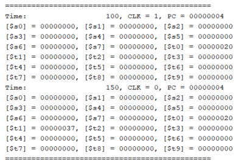

| cycle | Instruction               | Result         |
| ----- | ------------------------- | -------------- |
| 1     | addi `$t1`, `$zero`, 0x37 | [`$t1`] = 0x37 |


| cycle | Instruction             | Result         |
| ----- | ----------------------- | -------------- |
| 2     | and `$s0`, `$t0`, `$t1` | [`$s0`] = 0x20 |


| cycle | Instruction            | Result         |
| ----- | ---------------------- | -------------- |
| 3     | or `$s0`, `$t0`, `$t1` | [`$s0` = 0x37] |


| cycle | Instruction          | Result             |
| ----- | -------------------- | ------------------ |
| 4     | sw `$s0`, 4(`$zero`) | data.mem[4] = 0x37 |


| cycle | Instruction          | Result             |
| ----- | -------------------- | ------------------ |
| 5     | sw `$t0`, 8(`$zero`) | data.mem[8] = 0x20 |


| cycle | Instruction             | Result         |
| ----- | ----------------------- | -------------- |
| 6     | add `$s1`, `$t0`, `$t1` | [`$s1`] = 0x57 |

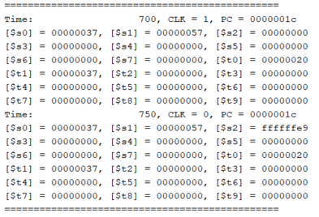

| cycle | Instruction             | Result               |
| ----- | ----------------------- | -------------------- |
| 7     | sub `$s2`, `$t0`, `$t1` | [`$s2`] = 0xffffffe9 |


| cycle | Instruction               | Result  |
| ----- | ------------------------- | ------- |
| 8     | addi `$t0`, `$zero`, 0x20 | nothing |

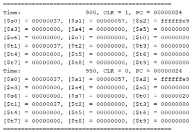

| cycle | Instruction               | Result  |
| ----- | ------------------------- | ------- |
| 9     | addi `$t0`, `$zero`, 0x20 | nothing |


| cycle | Instruction               | Result  |
| ----- | ------------------------- | ------- |
| 10    | addi `$t0`, `$zero`, 0x20 | nothing |


| cycle | Instruction              | Result     |
| ----- | ------------------------ | ---------- |
| 11    | beq `$s1`, `$s2`, error0 | not branch |


| cycle | Instruction          | Result         |
| ----- | -------------------- | -------------- |
| 12    | lw `$s1`, 4(`$zero`) | [`$s1`] = 0x37 |

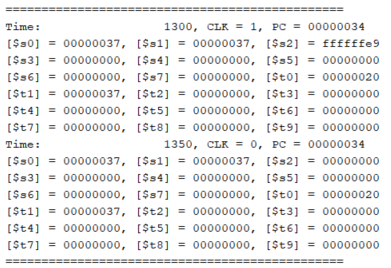

| cycle | Instruction             | Result        |
| ----- | ----------------------- | ------------- |
| 13    | andi `$s2`, `$s1`, 0x48 | [`$s2`] = 0x0 |

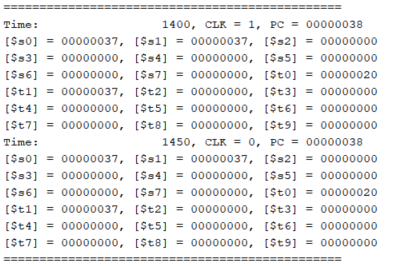

| cycle | Instruction               | Result  |
| ----- | ------------------------- | ------- |
| 14    | addi `$t0`, `$zero`, 0x20 | nothing |


| cycle | Instruction               | Result  |
| ----- | ------------------------- | ------- |
| 15    | addi `$t0`, `$zero`, 0x20 | nothing |


| cycle | Instruction               | Result  |
| ----- | ------------------------- | ------- |
| 16    | addi `$t0`, `$zero`, 0x20 | nothing |

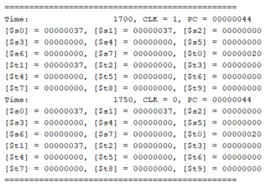

| cycle | Instruction              | Result  |
| ----- | ------------------------ | ------- |
| 17    | beq `$s1`, `$s2`, error1 | nothing |


| cycle | Instruction          | Result         |
| ----- | -------------------- | -------------- |
| 18    | lw `$s3`, 8(`$zero`) | [`$s3` = 0x20] |


| cycle | Instruction               | Result  |
| ----- | ------------------------- | ------- |
| 19    | addi `$t0`, `$zero`, 0x20 | nothing |

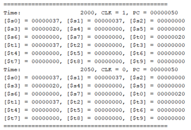

| cycle | Instruction               | Result  |
| ----- | ------------------------- | ------- |
| 20    | addi `$t0`, `$zero`, 0x20 | nothing |


| cycle | Instruction               | Result  |
| ----- | ------------------------- | ------- |
| 21    | addi `$t0`, `$zero`, 0x20 | nothing |

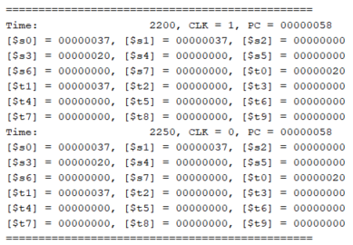

| cycle | Instruction              | Result  |
| ----- | ------------------------ | ------- |
| 22    | beq `$s0`, `$s3`, error2 | nothing |


| cycle | Instruction                    | Result        |
| ----- | ------------------------------ | ------------- |
| 23    | slt `$s4`, `$s2`, `$s1` (Last) | [`$s4` = 0x1] |

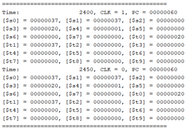

| cycle | Instruction               | Result  |
| ----- | ------------------------- | ------- |
| 24    | addi `$t0`, `$zero`, 0x20 | nothing |

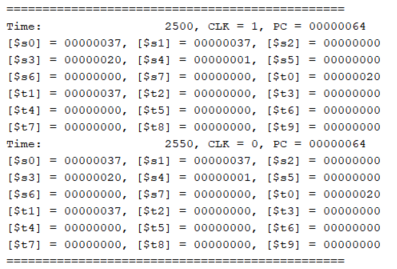

| cycle | Instruction               | Result  |
| ----- | ------------------------- | ------- |
| 25    | addi `$t0`, `$zero`, 0x20 | nothing |

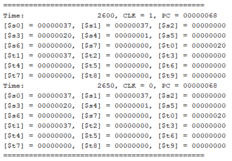

| cycle | Instruction               | Result  |
| ----- | ------------------------- | ------- |
| 26    | addi `$t0`, `$zero`, 0x20 | nothing |

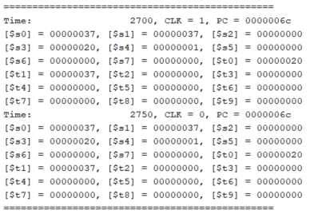

| cycle | Instruction           | Result  |
| ----- | --------------------- | ------- |
| 27    | beq `$s4`, `$0`, EXIT | nothing |


| cycle | Instruction            | Result         |
| ----- | ---------------------- | -------------- |
| 28    | add `$s2`, `$s1`, `$0` | [`$s2` = 0x37] |


| cycle | Instruction | Result       |
| ----- | ----------- | ------------ |
| 29    | j Last      | jump to last |

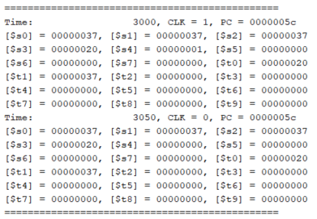

| cycle | Instruction                    | Result        |
| ----- | ------------------------------ | ------------- |
| 30    | slt `$s4`, `$s2`, `$s1` (Last) | [`$s4` = 0x0] |

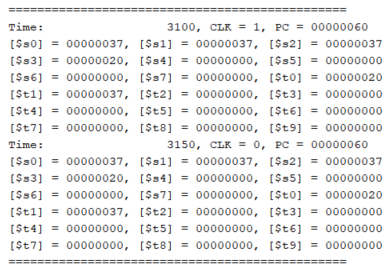

| cycle | Instruction               | Result  |
| ----- | ------------------------- | ------- |
| 31    | addi `$t0`, `$zero`, 0x20 | nothing |

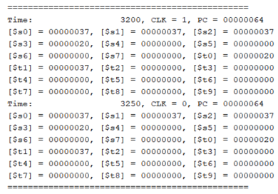

| cycle | Instruction               | Result  |
| ----- | ------------------------- | ------- |
| 32    | addi `$t0`, `$zero`, 0x20 | nothing |


| cycle | Instruction               | Result  |
| ----- | ------------------------- | ------- |
| 33    | addi `$t0`, `$zero`, 0x20 | nothing |


| cycle | Instruction           | Result       |
| ----- | --------------------- | ------------ |
| 34    | beq `$s4`, `$0`, EXIT | jump to Exit |

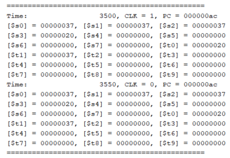

| cycle | Instruction | Result  |
| ----- | ----------- | ------- |
| 35    | nop         | nothing |

It is clear that the simulated results highly concides with the theoretical results, which means our implementation is successful.

### Conclusion & Discussion

In this project, I am asked to model a single cycle processor which can support mulitple MIPS instructions including `lw`, `sub`,`sw`, `beq` and etc. From the simulated result, it is clear that our results highly coincides with the theoretical results which means my implementation is successful. However, considering the performance of the single cycle processor, we should improve the current design, therefore, in the second part of this project 2, I will introduce another kind of processor, which is called Pipeline processor.

### Peer Evaluation

| Name          | Level of Contribution | Description of contribution |
| ------------- | --------------------- | --------------------------- |
| Zhou Zhanpeng | 5                     | Modeling + Implementing     |
| Liu Yihua     | 5                     | Modeling + Implementing     |
| Shen Yang     | 5                     | Modeling + Implementing     |
| Peng Haotian  | 5                     | Modeling + Implementing     |

### Reference

[1] Zheng, G., 2020. *Ve370 Introduction To Computer Organization Project 2*.

### Appendix

#### Source Code

##### ALU.v

```verilog
`timescale 1ns / 1ps

module ALU(zero, result, a, b, ALU_control);
    parameter word = 32;
    input   [word - 1:0]    a,           b;
    input   [3:0]           ALU_control;
    output                  zero;
    output  [word - 1:0]    result;
    
    reg     [word - 1:0]    result;
    
    initial begin
        result = 0;
    end
    
    always @(a or b or ALU_control) begin
        case (ALU_control)
            // add
            4'b0010: result = a + b;
            // sub
            4'b0110: result = a - b;
            // and
            4'b0000: result = a & b;
            // or
            4'b0001: result = a | b;
            // slt
            4'b0111: result = (a < b)?1:0;
            default: result = 0;
        endcase
    end
    
    assign zero = ~(|(result[31:0]));
endmodule
```

##### ALUcontrol.v

```verilog
`timescale 1ns / 1ps

module ALUcontrol(ALU_control, funct, ALU_op);
    input   [1:0]   ALU_op;
    input   [5:0]   funct;
    output  [3:0]   ALU_control;
    
    reg     [3:0]   ALU_control;
    
    initial begin
        ALU_control = 0;
    end
    
    always @ (funct or ALU_op) begin
        case (ALU_op)
            2'b00: ALU_control = 4'b0010;
            2'b01: ALU_control = 4'b0110;
            2'b11: ALU_control = 4'b0000;
            2'b10: begin
                case (funct)
                    6'b100000: ALU_control = 4'b0010;
                    6'b100010: ALU_control = 4'b0110;
                    6'b100101: ALU_control = 4'b0001;
                    6'b101010: ALU_control = 4'b0111;
                    6'b100100: ALU_control = 4'b0000; 
                    default:   ALU_control = 4'b0000;
                endcase
            end
            default: ALU_control <= 4'b0000;
        endcase
    end
endmodule
```

##### PC.v

```verilog
`timescale 1ns / 1ps

module PC(curr, clk, next);
    parameter word = 32;
    
    input   [word - 1:0]    next;
    input                   clk;
    output  [word - 1:0]    curr;
    
    reg     [word - 1:0]    PC_mem;
    
    initial begin
        $display("===============================================");
        $display("Time: %d, CLK = %b, PC = %h", $time, 1'b1, PC_mem);
        PC_mem = 0;
    end

    always @(clk) begin
        if (clk == 1'b1) begin
            PC_mem = next;
            $display("===============================================");
        end
        $display("Time: %d, CLK = %b, PC = %h", $time, clk, PC_mem);
    end 
    
    assign curr = PC_mem;
endmodule
```

##### adder.v

```verilog
`timescale 1ns / 1ps

module adder(result, a, b);
    parameter word = 32;

    input   [word - 1:0]    a,     b;
    output  [word - 1:0]    result;
    
    reg     [word - 1:0]    result;
    
    initial begin
        result = 0;
    end
    
    always @(a, b) begin
        result = a + b;
    end
endmodule
```

##### control.v

```verilog
module control(RegDst, Jump, Branch, MemRead, MemtoReg, ALUop, MemWrite, ALUSrc, RegWrite, Beq, op);
    input   [5:0]   op;
    output          RegDst, Jump, Branch, MemRead, MemtoReg, MemWrite, ALUSrc, RegWrite, Beq;
    output  [1:0]   ALUop;

    reg             RegDst, Jump, Branch, MemRead, MemtoReg, MemWrite, ALUSrc, RegWrite, Beq;
    reg     [1:0]   ALUop;
    
    initial begin
        ALUop = 2'b00; RegDst = 0; Jump = 0; Branch = 0; MemRead = 0; MemtoReg = 0; MemWrite = 0; ALUSrc = 0; RegWrite = 0; Beq = 0;
    end

    always @(op) begin
        case (op)
            // lw
            6'b100011: begin
                ALUop = 2'b00; RegDst = 0; Jump = 0; Branch = 0; MemRead = 1; MemtoReg = 1; MemWrite = 0; ALUSrc = 1; RegWrite = 1; Beq = 0;
            end

            // sw
            6'b101011: begin
                ALUop = 2'b00; RegDst = 0; Jump = 0; Branch = 0; MemRead = 0; MemtoReg = 0; MemWrite = 1; ALUSrc = 1; RegWrite = 0; Beq = 0;
            end

            // R-type
            6'b000000: begin
                ALUop = 2'b10; RegDst = 1; Jump = 0; Branch = 0; MemRead = 0; MemtoReg = 0; MemWrite = 0; ALUSrc = 0; RegWrite = 1; Beq = 0;
            end

            // addi
            6'b001000: begin
                ALUop = 2'b00; RegDst = 0; Jump = 0; Branch = 0; MemRead = 0; MemtoReg = 0; MemWrite = 0; ALUSrc = 1; RegWrite = 1; Beq = 0;
            end

            // andi
            6'b001100: begin
                ALUop = 2'b11; RegDst = 0; Jump = 0; Branch = 0; MemRead = 0; MemtoReg = 0; MemWrite = 0; ALUSrc = 1; RegWrite = 1; Beq = 0;
            end

            // beq
            6'b000100: begin
                ALUop = 2'b01; RegDst = 0; Jump = 0; Branch = 1; MemRead = 0; MemtoReg = 0; MemWrite = 0; ALUSrc = 0; RegWrite = 0; Beq = 1;
            end

            // bne
            6'b000101: begin
                ALUop = 2'b01; RegDst = 0; Jump = 0; Branch = 1; MemRead = 0; MemtoReg = 0; MemWrite = 0; ALUSrc = 0; RegWrite = 0; Beq = 0;
            end

            // j
            6'b000010: begin
                ALUop = 2'b00; RegDst = 0; Jump = 1; Branch = 0; MemRead = 0; MemtoReg = 0; MemWrite = 0; ALUSrc = 0; RegWrite = 0; Beq = 0;
            end
            
            default: begin
                ALUop = 2'b00; RegDst = 0; Jump = 0; Branch = 0; MemRead = 0; MemtoReg = 0; MemWrite = 0; ALUSrc = 0; RegWrite = 0; Beq = 0;
            end
        endcase
    end
endmodule
```

##### data_mem.v

```verilog
module data_mem(read_data, read_addr, write_data, mem_write, mem_read, clk);
    parameter word   = 32;
    parameter byte   = 8;
    parameter number = 1000;
    
    input   [word - 1:0] read_addr, write_data;
    input                mem_write, mem_read,   clk;
    output  [word - 1:0] read_data;
    
    reg     [byte - 1:0] memory[number - 1:0];
    reg     [word - 1:0] read_data;

    integer                  n;

    initial begin
        for (n = 0; n < number; n = n + 1) begin
            memory[n] = 0;
        end
    end
    
    always @(negedge clk) begin
        if (mem_write)  begin
            memory[read_addr] = write_data[word - 1:word - byte];
            memory[read_addr + 1] = write_data[word - byte - 1:word - 2*byte];
            memory[read_addr + 2] = write_data[word - 2*byte - 1:word - 3*byte];
            memory[read_addr + 3] = write_data[word - 3*byte - 1:0];
        end
    end
    
    always @(mem_read or read_addr) begin
        read_data = 'bz;
        if (mem_read) begin
            read_data = {memory[read_addr], memory[read_addr+1], memory[read_addr+2], memory[read_addr+3]};
        end 
    end
endmodule
```

##### instr_mem.v

```verilog
module instr_mem(instruction, read_addr);
    parameter word = 32;
    parameter byte = 8;
    parameter line = 42;
    
    input   [word - 1:0]    read_addr;
    output  [word - 1:0]    instruction;
    
    reg     [byte - 1:0]    mem[4*line - 1:0];
    reg     [word - 1:0]    instruction;
    
    initial begin
        $readmemb("D:/JI/2020 fall/VE370 Intro to Computer Organization/Projects/P2/InstructionMem_for_P2_Demo.txt", mem);
    end
    
    always @ (read_addr) begin
        instruction = {mem[read_addr], mem[read_addr + 1], mem[read_addr+2], mem[read_addr+3]};
    end
endmodule
```

##### mux.v

```verilog
module mux(F, sel, A, B);
    parameter N = 32;
    
    input               sel;
    input   [N-1 : 0]   A,  B;
    output  [N-1 : 0]   F; 
    
    reg     [N-1 : 0]   F;
    
    initial begin
        F = 0;
    end
    
    always @ (A, B, sel) begin
        case (sel)
            1'b0 : F = A;
            1'b1 : F = B;
            default : F = 0;
        endcase
    end
endmodule
```

##### reg_file.v

```verilog
module reg_file(read_data1, read_data2, read_addr1, read_addr2, write_addr, write_data, regwrite, clk);
    parameter addr_size = 5;
    parameter word = 32;
    
    input   [addr_size - 1:0] read_addr1, read_addr2, write_addr;
    input   [word - 1:0]      write_data;
    input                     regwrite,   clk;
    output  [word - 1:0]      read_data1, read_data2;
    
    reg     [word - 1:0]      reg_mem[2**addr_size - 1:0];
    integer                   n;
    
    initial begin
        $display("[$s0] = %h, [$s1] = %h, [$s2] = %h", reg_mem[16], reg_mem[17], reg_mem[18]);
        $display("[$s3] = %h, [$s4] = %h, [$s5] = %h", reg_mem[19], reg_mem[20], reg_mem[21]);
        $display("[$s6] = %h, [$s7] = %h, [$t0] = %h", reg_mem[22], reg_mem[23], reg_mem[8]);
        $display("[$t1] = %h, [$t2] = %h, [$t3] = %h", reg_mem[9], reg_mem[10], reg_mem[11]);
        $display("[$t4] = %h, [$t5] = %h, [$t6] = %h", reg_mem[12], reg_mem[13], reg_mem[14]);
        $display("[$t7] = %h, [$t8] = %h, [$t9] = %h", reg_mem[15], reg_mem[24], reg_mem[25]);
        for (n = 0; n < 2**addr_size; n = n + 1) begin
            reg_mem[n] = 0;
        end
    end

    always @(clk) begin
        if (clk == 1'b0 && regwrite == 1'b1) begin
            reg_mem[write_addr] = write_data;
        end
        $display("[$s0] = %h, [$s1] = %h, [$s2] = %h", reg_mem[16], reg_mem[17], reg_mem[18]);
        $display("[$s3] = %h, [$s4] = %h, [$s5] = %h", reg_mem[19], reg_mem[20], reg_mem[21]);
        $display("[$s6] = %h, [$s7] = %h, [$t0] = %h", reg_mem[22], reg_mem[23], reg_mem[8]);
        $display("[$t1] = %h, [$t2] = %h, [$t3] = %h", reg_mem[9], reg_mem[10], reg_mem[11]);
        $display("[$t4] = %h, [$t5] = %h, [$t6] = %h", reg_mem[12], reg_mem[13], reg_mem[14]);
        $display("[$t7] = %h, [$t8] = %h, [$t9] = %h", reg_mem[15], reg_mem[24], reg_mem[25]);
        if (clk != 1'b1) begin
            $display("===============================================");
        end
    end
    
    assign read_data1 = reg_mem[read_addr1];
    assign read_data2 = reg_mem[read_addr2];
endmodule
```

##### scp.v

```verilog
module scp(clk);
    parameter word     = 32;
    parameter reg_addr = 5;

    input clk;

    wire    [word - 1:0]        curr_addr,      instruction,    next_addr;
    wire    [word - 1:0]        read_data1,     read_data2,     write_data;  
    wire    [word - 1:0]        extended,       ALU_input2,     ALU_result;
    wire    [word - 1:0]        mem_data,       pcplusfor,      jump_addr;  
    wire    [word - 1:0]        brc_addr_part,  branch_addr,    next_addr_part;    
    wire    [27:0]              jump_addr_part;
    wire    [reg_addr - 1:0]    write_addr;
    wire    [3:0]               ALU_control;
    wire    [1:0]               ALUop;
    wire                        RegDst,         Jump,           Branch,     MemRead,    MemtoReg; 
    wire                        MemWrite,       ALUSrc,         RegWrite,   Beq;
    wire                        zero,           real_brc,       brc_part;

    assign      jump_addr = {pcplusfor[31:28], jump_addr_part};
    assign      real_brc = brc_part & Branch;

    PC          pc(curr_addr, clk, next_addr);
    instr_mem   instrmem(instruction, curr_addr);
    control     ctrl(RegDst, Jump, Branch, MemRead, MemtoReg, ALUop, MemWrite, ALUSrc, RegWrite, Beq, instruction[31:26]);
    ALUcontrol  aluctrl(ALU_control, instruction[5:0], ALUop);
    mux      #5 regdst(write_addr, RegDst, instruction[20:16], instruction[15:11]);
    mux         alusrc(ALU_input2, ALUSrc, read_data2, extended);
    mux      #1 beq(brc_part, Beq, ~zero, zero);
    mux         branch(next_addr_part, real_brc, pcplusfor, branch_addr);
    mux         jump(next_addr, Jump, next_addr_part, jump_addr);
    mux         mem2reg(write_data, MemtoReg, ALU_result, mem_data);
    reg_file    regfile(read_data1, read_data2, instruction[25:21], instruction[20:16], write_addr, write_data, RegWrite, clk);
    sign_ext    ext(extended, instruction[15:0]);
    ALU         alu(zero, ALU_result, read_data1, ALU_input2, ALU_control);
    data_mem    datamem(mem_data, ALU_result, read_data2, MemWrite, MemRead, clk);    
    adder       first(pcplusfor, curr_addr, 4);        
    shifter_1   sh1(jump_addr_part, instruction[25:0]);
    shifter_2   sh2(brc_addr_part, extended);
    adder       second(branch_addr, pcplusfor, brc_addr_part);
    
endmodule
```

##### shifter_1.v

```verilog
module shifter_1(out, in);
    parameter in_size = 26;
    parameter by = 2;
    
    input [in_size - 1:0] in;
    output [in_size - 1 + by:0] out;
    
    assign out[in_size - 1+by:by] = in;
    assign out[by - 1:0] = 0;
endmodule
```

##### shifter_2.v

```verilog
module shifter_2(out, in);
    parameter word = 32;
    parameter by = 2;
    
    input [word - 1:0] in;
    output [word - 1:0] out;
    
    assign out[word - 1:by] = in[word - 1 - by:0];
    assign out[by - 1:0] = 0;
endmodule
```

##### sign_ext.v

```verilog
module sign_ext(out, in);
    parameter word = 32;
    parameter half_word = 16;
    
    input [half_word - 1:0] in;
    output [word - 1:0] out;
    
    assign out = {{half_word{in[half_word-1]}}, in};
endmodule
```

##### simulation.v

```verilog
module simulation;
    parameter half_period = 50;

    reg     clk;
 
    scp     UUT(clk);
    
    initial #0 begin
        #0 clk <= 0;
    end

    always #half_period clk = ~clk;

    initial #1000 $finish;
endmodule
```

#### Sample Instructions

##### **InstructionMem_for_P2_Demo.txt**

```reStructuredText
00100000 00001000 00000000 00100000 //addi $t0, $zero, 0x20
00100000 00001001 00000000 00110111 //addi $t1, $zero, 0x37
00000001 00001001 10000000 00100100 //and $s0, $t0, $t1
00000001 00001001 10000000 00100101 //or $s0, $t0, $t1
10101100 00010000 00000000 00000100 //sw $s0, 4($zero)
10101100 00001000 00000000 00001000 //sw $t0, 8($zero)
00000001 00001001 10001000 00100000 //add $s1, $t0, $t1
00000001 00001001 10010000 00100010 //sub $s2, $t0, $t1
00100000 00001000 00000000 00100000 //addi $t0, $zero, 0x20
00100000 00001000 00000000 00100000 //addi $t0, $zero, 0x20
00100000 00001000 00000000 00100000 //addi $t0, $zero, 0x20
00010010 00110010 00000000 00010010 //beq $s1, $s2, error0
10001100 00010001 00000000 00000100 //lw $s1, 4($zero)
00110010 00110010 00000000 01001000 //andi $s2, $s1, 0x48
00100000 00001000 00000000 00100000 //addi $t0, $zero, 0x20
00100000 00001000 00000000 00100000 //addi $t0, $zero, 0x20
00100000 00001000 00000000 00100000 //addi $t0, $zero, 0x20
00010010 00110010 00000000 00001111 //beq $s1, $s2, error1
10001100 00010011 00000000 00001000 //lw $s3, 8($zero)
00100000 00001000 00000000 00100000 //addi $t0, $zero, 0x20
00100000 00001000 00000000 00100000 //addi $t0, $zero, 0x20
00100000 00001000 00000000 00100000 //addi $t0, $zero, 0x20
00010010 00010011 00000000 00001101 //beq $s0, $s3, error2
00000010 01010001 10100000 00101010 //slt $s4, $s2, $s1 (Last)
00100000 00001000 00000000 00100000 //addi $t0, $zero, 0x20
00100000 00001000 00000000 00100000 //addi $t0, $zero, 0x20
00100000 00001000 00000000 00100000 //addi $t0, $zero, 0x20
00010010 10000000 00000000 00001111 //beq $s4, $0, EXIT
00000010 00100000 10010000 00100000 //add $s2, $s1, $0
00001000 00000000 00000000 00010111 //j Last
00100000 00001000 00000000 00000000 //addi $t0, $0, 0(error0)
00100000 00001001 00000000 00000000 //addi $t1, $0, 0
00001000 00000000 00000000 00111111 //j EXIT
00100000 00001000 00000000 00000001 //addi $t0, $0, 1(error1)
00100000 00001001 00000000 00000001 //addi $t1, $0, 1
00001000 00000000 00000000 00111111 //j EXIT
00100000 00001000 00000000 00000010 //addi $t0, $0, 2(error2)
00100000 00001001 00000000 00000010 //addi $t1, $0, 2
00001000 00000000 00000000 00111111 //j EXIT
00100000 00001000 00000000 00000011 //addi $t0, $0, 3(error3)
00100000 00001001 00000000 00000011 //addi $t1, $0, 3
00001000 00000000 00000000 00111111 //j EXIT
```

---------------------------------------------------------------

<center>
    UM-SJTU Joint Institute 交大密西根学院
</center>

