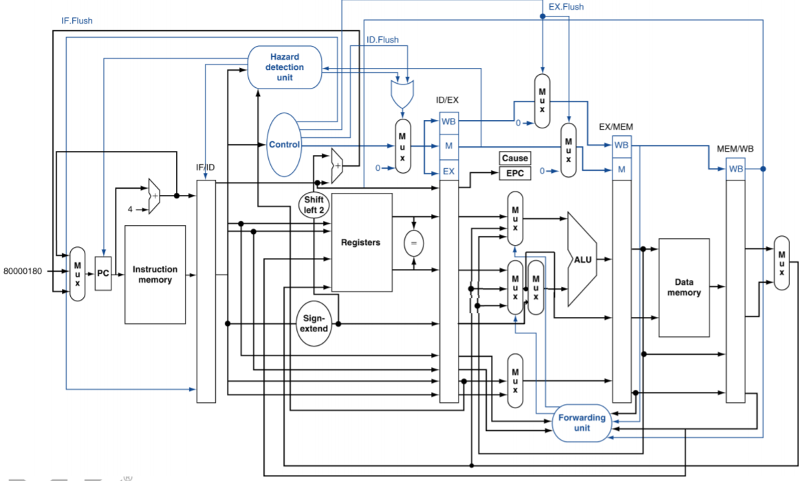

<div style="text-align:center">
	
</div>
<center>
	<h2>
		VE370 Intro to Computer Organization
	</h2>
</center> 
<center>
	<h3>
		Project 2 Team Report
	</h3>
</center>
<center>
   <h4>
       FA 2020
    </h4> 
</center>
------------------------------------------

|     Name      |   Stud. ID   |
| :-----------: | :----------: |
| Zhou Zhanpeng | 518021910594 |
|   Liu Yihua   | 518021910998 |
|   Shen Yang   | 518370910027 |
| Peng Haotian  | 518370910107 |

-------------------------------

### Abstract

In this report, we demonstrate our implementation of a 5-stage pipelined processor based on MIPS instruction set and Verilog HDL modeling. Our project implements a pipelined processor in MIPS architecture with a forwarding unit and two hazard detecting unit to resolve hazard issues. We use Verilog HDL to model the processor and verify our design by Vivado simulation included in this report. Besides, we also demonstrate our design on a FPGA board.

###  Introduction

In this project, we implement a 5-stage pipelined processor based on MIPS instruction set with a forwarding unit and two hazard detecting unit to resolve hazard issues. MIPS is an open source instruction set architecture with high performance that is widely used in embedded systems. Pipelined processor is implemented by a technique called instruction pipelining that is implemented by dividing instructions into a series of pipelines so that the processor's cycle time is reduced. It is simple, reliable, and fast.

To realize instruction pipelining, we divide the handling of instructions into 5 stages: IF (instruction fetch), ID (instruction decode), EX (execute), MEM (memory access), and (register write back). Between them, we have 4 stage registers: IF/ID register, ID/EX register, EX/MEM register, MEM/WB register. In the first stage, we acquire PC address and instruction from instruction memory; in the second stage, we acquire control signals, do register reading or writing if applicable, and detect hazards; in the third stage, we do ALU (Arithmetic Logic Unit) calculation and forwarding if applicable; in the fourth stage, we read or write data from the data memory; in the fifth stage, we select a write-back signal.

### Description

#### Overview



Basically, our modeling and implementation is following above picture. However, some part is added and some part is deleted due to our specialized design. For example, to support `j` type instruction, we add an another mux before PC to select the jump target address. Also, EX.flush signal has no usage in our design then we simply remove it.

Next, we will go deeper about how we model the stage register, memory and how to resolve data hazard and control hazard. We will not talk about how to model a mux or comparator in later sections because they are simple to implement.

#### Stage Register

In pipelined processor, we use four stage registers to process signals: IF/ID, ID/EX, EX/MEM, MEM/WB. The names of wires and registers we use in state registers with their corresponding descriptions are list below.

Specially, the stage register is triggered by rising edge of clock. And for IF/ID & ID/EX, there are two control signal to flush all the content or just control signals passed in to zero.

|        | Name         | Descriptions                                         |
| ------ | ------------ | ---------------------------------------------------- |
| input  | clk          | clock signal                                         |
|        | IFID_write   | whether to write IF/ID stage register                |
|        | IF_flush     | whether to flush IF stage                            |
|        | IF_instr     | instruction from the instruction memory in IF stage  |
|        | IF_pcplus4   | the value of PC + 4 in IF stage                      |
| output | IFID_instr   | instruction output from IF/ID stage register         |
|        | IFID_pcplus4 | the value of PC + 4 output from IF/ID stage register |

<center>
    <h6>
        Table 1. IF/ID stage register.
    </h6>
</center>
|        | Name           | Descriptions                         |
| ------ | -------------- | ------------------------------------ |
| input  | clk            | clock signal                         |
|        | IF_flush       | whether to flush IF stage            |
|        | regReadData1ID | registers read data 1 in ID stage    |
|        | regReadData2ID | registers read data 2 in ID stage    |
|        | signExtendID   | output of sign-extend in ID stage    |
|        | registerRsID   | the value of register rs in ID stage |
|        | registerRtID   | the value of register rt in ID stage |
|        | registerRdID   | the value of register rd in ID stage |
|        | aluOpID        | control signal ALUOp in ID stage     |
|        | regDstID       | control signal RegDst in ID stage    |
|        | memReadID      | control signal MemRead in ID stage   |
|        | memtoRegID     | control signal MemtoReg in ID stage  |
|        | memWriteID     | control signal MemWrite in ID stage  |
|        | aluSrcID       | control signal ALUSrc in ID stage    |
|        | regWriteID     | control signal RegWrite in ID stage  |
| output | regReadData1EX | registers read data 1 in EX stage    |
|        | regReadData2EX | registers read data 2 in EX stage    |
|        | signExtendEX   | output of sign-extend in EX stage    |
|        | registerRsEX   | the value of register rs in EX stage |
|        | registerRtEX   | the value of register rt in EX stage |
|        | registerRdEX   | the value of register rd in EX stage |
|        | aluOpEX        | control signal ALUOp in EX stage     |
|        | regDstEX       | control signal RegDst in EX stage    |
|        | memReadEX      | control signal MemRead in EX stage   |
|        | memtoRegEX     | control signal MemtoReg in EX stage  |
|        | memWriteEX     | control signal MemWrite in EX stage  |
|        | aluSrcEX       | control signal ALUSrc in EX stage    |
|        | regWriteEX     | control signal RegWrite in EX stage  |

<center>
    <h6>
        Table 2. ID/EX stage register.
    </h6>
</center>
|        | Name             | Descriptions                                |
| ------ | ---------------- | ------------------------------------------- |
| input  | Clock            | clock signal                                |
|        | EX\_MemRead      | control signal MemRead in EX stage          |
|        | EX\_MemtoReg     | control signal MemtoReg in EX stage         |
|        | EX\_MemWrite     | control signal MemWrite in EX stage         |
|        | EX\_RegWrite     | control signal RegWrite in EX stage         |
|        | EX\_MUX8\_out    | the destination register in EX stage        |
|        | EX\_ALU\_result  | ALU result as an output of ALU in EX stage  |
|        | EX\_MUX6\_out    | the value of R[rt] in EX stage              |
| output | MEM\_MemRead     | control signal MemRead in MEM stage         |
|        | MEM\_MemtoReg    | control signal MemtoReg in MEM stage        |
|        | MEM\_MemWrite    | control signal MemWrite in MEM stage        |
|        | MEM\_RegWrite    | control signal RegWrite in MEM stage        |
|        | MEM\_MUX8\_out   | the destination register in MEM stage       |
|        | MEM\_ALU\_result | ALU result as an output of ALU in MEM stage |
|        | MEM\_MUX6\_out   | the value of R[rt] in MEM stage             |

<center>
    <h6>
        Table 3. EX/MEM stage register.
    </h6>
</center>
|        | Name                          | Descriptions                                |
| ------ | ----------------------------- | ------------------------------------------- |
| input  | Clock                         | clock signal                                |
|        | MEM\_RegWrite                 | control signal RegWrite in MEM stage        |
|        | MEM\_MemtoReg                 | control signal MemtoReg in MEM stage        |
|        | MEM\_MUX8\_out                | the destination register in MEM stage       |
|        | MEM\_Data\_memory\_Read\_data | data memory read data in MEM stage          |
|        | MEM\_ALU\_result              | ALU result as an output of ALU in MEM stage |
| output | WB\_MemtoReg                  | control signal MemtoReg in WB stage         |
|        | WB\_RegWrite                  | control signal RegWrite in WB stage         |
|        | WB\_MUX8\_out                 | the destination register in WB stage        |
|        | WB\_Data\_memory\_Read\_data  | data memory read data in WB stage           |
|        | WB\_ALU\_result               | ALU result as an output of ALU in WB stage  |

<center>
    <h6>
        Table 4. MEM/WB stage register.
    </h6>
</center>

#### Memory

The implementation of the memory part includes **Data Memory** (module *data_mem­* in the source code), **Instruction Memory** (module *Instr_mem* in the source code) and **Register File** (module *reg_file* in the source file). There are some typical designing details in this project:

1. The data is byte-addressable. Though this project is based on word addresses, the real memory units supported by MIPS should be byte-addressable. There are some typical MIPS instructions that needs the addresses of byte, such as lb, lbu and lh. Though those instruction are not needed in this project, we still consider this condition in case we could develop more instructions through this project in future.

2. The data memory and register file are driven by the negative edge of clock in this project. This design may lengthen the critical path, but it could avoid some hazards:

   ```verilog
   always @(negedge clk) begin
              if (mem_write)  begin
                  memory[read_addr] = write_data[word - 1:word - byte];
                  memory[read_addr + 1] = write_data[word - byte - 1:word - 2*byte];
                  memory[read_addr + 2] = write_data[word - 2*byte - 1:word - 3*byte];
                  memory[read_addr + 3] = write_data[word - 3*byte - 1:0];
              end
      end
   ```
   
   Take a part of the implementation of data memory as an example. If we update data in the positive edge, which is the beginning of a new clock cycle, the value of some variables may stay as the former clock cycle while some already change. If the write data has changed and the address of the write data stays the same, then wrong data will be updated into the write address of the last instruction. With the time of the first half of the clock cycle, this hidden hazard could be solved.

The detailed descriptions of the three memory units are shown below:

##### **Data Memory**

Data memory is used to store most data. In this project, due to the restriction of the software, we limit the capacity as 1000 words (4KB). The module of data memory takes 6 variables, including 5 inputs ( *read_addr, write_data, mem_write, mem_read, clk*) and 1 output (*read_data*). The module will read or write data through a 32*1000 register called memory. If *mem_write* = 1, the output variable *read_data* will be updated with the data stores in *read_addr* in the *memory.*

##### **Instruction Memory**

Instruction memory is used to stores the MIPS instructions in a program in words. The PC could get the data of an instruction by searching the address of that data. In this project, we limit the capacity of the instruction memory as 42 words, which means it can hold at most 42 instructions. The module of instruction memory takes 2 variables, including 1 input (*read_addr*) and 1 output (*instruction*). To simulate a program, the data in the memory is initialized from the file `InstructionMem_for_P2_Demo_bonus.txt`, which is attached in **appendix**.

The module will read the *read_addr* and find the correspond instruction to update in *instruction.*

##### **Register File**

Register file is used to store the data of the 32 most commonly used registers. The order of these registers is shown below:


In this project, the module of data memory takes 8 variables, including 6inputs (*read_addr1, read_addr2, write_addr, write_data, regwrite, clk*) and 2outputs (*read_data1, read_data2*). To simplify the process, the data of every register is initialized as 32 bits 0. The *write_data* will be updated to correspond register at each negative edge. The *read_data* will be assigned to correspond register whenever the *rrad_addr* changes (read is asynchronous while write is synchronous).

#### **Control Unit**

The control unit is used to generate control signals from different 6 bits opcodes. From the structure of pipeline in VE370 lectures, the control unit should generate 9 outputs as follows:

```verilog
initial begin
        ALUop = 2'b00; RegDst = 0; Jump = 0; Branch = 0; MemRead = 0; MemtoReg = 0; MemWrite = 0; ALUSrc = 0; RegWrite = 0; Beq = 0;
end
```

In this project, to support both `beq` and `bne` instructions, we introduce another output called `beq`. `Beq` will only be 1 when the instruction is `beq`. If both `branch` and `beq` signals equal to 1 we could determine the instruction as `beq`. If *branch* signal equals to 1 while `beq` signal equal to 0, then the instruction is `bne`. 

#### ALU Related Modules

This part describes the ALU related modules in the pipelined processor, including the `ALUop` signal, the ALU control unit and the ALU unit. The processor first produces a 2-bit `ALUop` signal by the control unit. Then the `ALUop` signal is processed by the ALU control unit which will output a 4-bit ALU control signal. Finally the ALU unit executes the computation according to the ALU control signal.

##### ALUOp

`ALUop` signal is a 2-bit signal, produced by the control unit according to different instruction. `ALUop` signal is one of the inputs of the ALU control unit, which determines the type of computation of the ALU unit. How ` ALUop` is designed is listed in the table below, together with the output result of the ALU control unit. R-type instructions share the same `ALUop` signal 10, to further identify different R-type instructions funct code need to be checked later.` lw, sw and addi` share `ALUop` of 00. `beq` and `bne` share `ALUop` of 01. andi produces `ALUop` of 11.

##### ALU Control Unit

ALU control unit takes two inputs, ALUop and funct, and outputs an 4-bit ALU control signal. The design is in the table below. Notice that actually `j` type instruction doesn’t need to perform ALU operation, thus, we just randomly picked one ALUop and corresponding ALU control for it.

| Op code         | Operation           | ALUop | Funct  | ALU control | ALU function |
| --------------- | ------------------- | ----- | ------ | ----------- | ------------ |
| lw (100011)     | load word           | 00    | xxxxxx | 0010        | add          |
| sw (101011)     | save word           | 00    | xxxxxx | 0010        | add          |
| addi (001000)   | add immediate       | 00    | xxxxxx | 0010        | add          |
| beq (000100)    | branch if equal     | 01    | xxxxxx | 0110        | subtract     |
| bne (000101)    | branch if not equal | 01    | xxxxxx | 0110        | subtract     |
| andi (001100)   | and immediate       | 11    | xxxxxx | 0000        | and          |
| R-type (000000) | add                 | 10    | 100000 | 0010        | add          |
|                 | sub                 | 10    | 100010 | 0110        | subtract     |
|                 | and                 | 10    | 100100 | 0000        | and          |
|                 | or                  | 10    | 100101 | 0001        | or           |
|                 | slt                 | 10    | 101010 | 0111        | slt          |
| j               | jump                | 00    | xxxxxx | 0010        | add          |

In this project, 12 instructions are to be implemented, including `lw, sw, beq, bne, add, sub, AND, OR, slt, addi, andi, j`. The funct code of all the I-type instructions doesn’t matter, marked as xxxxxx in the table. For the R-type instructions, different ALU control signals are determined by the funct code. 
`lw, sw, addi, add` require the ALU unit to do add function, so they share an ALU control code of 0010. Likewise, `beq, bne, sub` require subtract function, output 0110. `andi`, `AND` require `AND` function, output 0000. `OR` outputs 0001, indicating `OR` function. slt outputs 0111, indicating `slt` function.

##### ALU Unit

The ALU unit takes the ALU control signal from the previous ALU control unit, to determine the type of computation. 

| ALU control | ALU function |
| ----------- | ------------ |
| 0000        | and          |
| 0001        | or           |
| 0010        | add          |
| 0110        | subtract     |
| 0111        | slt          |

#### Data Hazard

This part describes how data hazards in this pipelined processor are solved. The data hazards that will occur can be categorized into three kinds, R-type data hazard, data hazard on branch, and data hazard on lw.

##### Forwarding Unit

Data hazard caused by R-type instructions is the simplest and can be solved by a forwarding unit, see the figure below. The unit controls the inputs of the ALU unit to make sure the value of the register being used is updated, if the previous one or two instruction changes the value of `Rd` (`Rd` is not $0), and the previous `Rd` is the `Rs` or `Rt` of the current instruction.


The logic of the forwarding unit is as follows:
	Initially forwardA = 0, forwardB = 0.

- For 1&2 hazard:
  - If (regWrite.MEM && regRdMEM && (regRdMEM == regRsEX)
    - `forwardA = 2’b10`
  - If (regWrite.MEM && regRdMEM && (regRdMEM == regRtEX))
    - `forwardB = 2’b10`
- For 1&3 hazard (notice that we need to make sure there is no 1&2 hazard):
  - If (regWrite.WB && regRdWB && (regRdWB == regRsEX) && forwardA != 2’b10)
    - `forwardA = 2’b01`
  - If (regWrite.WB && regRdWB && (regRdWB == regRtEX) && forwardB != 2’b10)
    - `forwardB = 2’b01;`

This unit is named as `R_forward` in Appendix.

##### Data Hazard on Branch

Since the branch instruction result will be produced by the comparator early in the ID stage, the forwarding unit is not enough to solve the data hazard caused by beq and bne. Here 5 more signals are introduced, ` forward1, forward2, PCWrite, IFID_write, and ID_flush`. 

Initially `forward1 = 0, forward2 = 0, PCWrite = 1, IFID_write = 1, and ID_flush = 0.`

Amongst, `forward1 and forward2` are two select signals of muxes, as shown below. If the instruction in the MEM stage writes back to `Rd` (`Rd` is not $0), the instruction in ID stage is beq/bne, and Rd of the MEM stage is `Rs/Rt` in the ID stage, then `forward1/forward2 = 1`.


Specifically:

```verilog
if (EXMEM_regWrite && !EXMEM_memRead && ID_branch) begin
    if (EXMEM_regRd == ID_regRs) forward1 = 1;
    if (EXMEM_regRd == ID_regRt) forward2 = 1;
end
```

`PCWrite, IFID_write, and ID_flush` are used to insert stalls. 

If the EX stage instruction before beq/bne (currently in the ID stage) writes back to ` Rd` (Rd != `$0`), and `Rd` of the EX stage is Rs/Rt in the ID stage, then insert one stall, making `PCWrite = 0, IFID_write = 0 and ID_flush = 1`.

Else if the MEM stage instruction reads data from the data memory, meaning it will write back to `Rd` (`Rd` != `$0`) in next clock cycle; and the ID stage instruction is `beq/bne`, and `Rd` of the MEM stage is `Rs/Rt` in the ID stage, insert one stall as well.
Specifically:

```verilog
if (IDEX_regWrite && ID_branch) begin
    if (EX_regDst == ID_regRs || EX_regDst == ID_regRt) begin
        PCWrite = 0; IFID_write = 0; ID_flush = 1;
    end
end
if (EXMEM_memRead && ID_branch) begin
    if (EXMEM_regRd == ID_regRs || EXMEM_regRd == ID_regRt) begin
        PCWrite = 0; IFID_write = 0; ID_flush = 1;
    end
end
```

This unit is named as `brc_hazard` in Appendix.

##### `lw` Data hazard

The third kind of data hazard is caused by the `lw` instruction. Different from R-type instructions, the earliest time the lw instruction produces its result is the MEM stage. While forwarding back in time is impossible, a stall after the lw instruction is necessary. Again we use three signals to control stalls, `PCWrite, IFID_write, and ID_flush`.

Initially `PCWrite = 1, IFID_write = 1, and ID_flush = 0.`

If the EX stage instruction is `lw`, and `Rd (Rd != $0)` of `lw` is `Rs/Rt` of the ID stage instruction, insert a stall.
Specifically:

```verilog
if (IDEX_memRead && (IFID_regRs == IDEX_regRt || IFID_regRt == IDEX_regRt)) begin
	PCWrite     = 0;
	ID_flush    = 1;
	IFID_write  = 0;
end
```

#### Control Hazard

Simply, control hazard is resolved by flush the whole instruction and other content in `ID/EX` stage register. Firstly, based on `branch` and `beq` signals generated by control unit, we know if there is a `beq` instruction in ID stage right now. Then, we will compare the two register’s content, if the comparator gives 1 when `beq = 1` or gives 0 when `beq = 0`, we will simply flush the content in `ID/EX` stage register right now, this mechanism is called **Assume not taken**. 

However, if control unit gives `jump = 1`, which means there is a j-type instruction in `ID` stage, we will directly flush all the content in `ID/EX` stage register.

### Implementation & Simulation Results

#### RTL Schematic

Based on our design described above, we implement our pipeline processor in `vivado` which gives the schematic of our design shown as below.

This is the whole picture of our design including pipeline processor and ssd_driver and other thing.

 

This one is the internal deign of the pipeline processor.


#### Theoretical Results

In this report, we use `InstructionMem_for_P2_Demo_bonus.txt` to simulate our pipeline processor. Following is the theoretical results:

| cycle | Instruction                        | IF   | ID    | EX    | MEM   | WB    | Results                          |
| ----- | ---------------------------------- | ---- | ----- | ----- | ----- | ----- | -------------------------------- |
| 1     | 1. addi `$t0`, `$zero`, 0x20       | 1    | x     | x     | x     | x     |                                  |
| 2     | 2. addi `$t1`, `$zero`, 0x37       | 2    | 1     | x     | x     | x     |                                  |
| 3     | 3. and `$s0`, `$t0`, `$t1`         | 3    | 2     | 1     | x     | x     |                                  |
| 4     | 4. or `$s0`, `$t0`, `$t1`          | 4    | 3     | 2     | 1     | x     |                                  |
| 5     | 5. sw `$s0`, 4(`$zero`)            | 5    | 4     | 3     | 2     | 1     | `$t0` = 0x20                     |
| 6     | 6. sw `$t0`, 8(`$zero`)            | 6    | 5     | 4     | 3     | 2     | `$t1` = 0x37                     |
| 7     | 7. add `$s1`, `$t0`, `$t1`         | 7    | 6     | 5     | 4     | 3     | `$s0` = 0x20                     |
| 8     | 8. sub `$s2`, `$t0`, `$t1`         | 8    | 7     | 6     | 5     | 4     | `$s0` = 0x37; Data.Mem[4] = 0x37 |
| 9     | 9. beq `$s1`, `$s2`, error0        | 9    | 8     | 7     | 6     | 5     | Data.Mem[8] = 0x20               |
| 10    | 10. lw `$s1`, 4(`$zero`)           | 10   | 9     | 8     | 7     | 6     |                                  |
| 11    |                                    | 10   | 9     | nop   | 8     | 7     | `$s1` = 0x57                     |
| 12    | 11. andi `$s2`, `$s1`, 0x48        | 11   | 10    | 9     | nop   | 8     | `$s2` = 0xffffffe9               |
| 13    | 12. beq `$s1`, `$s2`, error1       | 12   | 11    | 10    | 9     | nop   |                                  |
| 14    |                                    | 12   | 11    | nop   | 10    | 9     |                                  |
| 15    | 13. lw `$s3`, 8(`$zero`)           | 13   | 12    | 11    | nop   | 10    | `$s1` = 0x37                     |
| 16    |                                    | 13   | 12    | nop   | 11    | nop   |                                  |
| 17    | 14. beq `$s0`, `$s3`, error2       | 14   | 13    | 12    | nop   | 11    | `$s2` = 0x0                      |
| 18    | 15. slt `$s4`, `$s2`, `$s1` (Last) | 15   | 14    | 13    | 12    | nop   |                                  |
| 19    |                                    | 15   | 14    | nop   | 13    | 12    |                                  |
| 20    |                                    | 15   | 14    | nop   | nop   | 13    | `$s3` = 0x20                     |
| 21    | 16. beq `$s4`, `$0`, EXIT          | 16   | 15    | 14    | nop   | nop   |                                  |
| 22    | 17. add `$s2`, `$s1`, `$0`         | 17   | 16    | 15    | 14    | nop   |                                  |
| 23    |                                    | 17   | 16    | nop   | 15    | 14    |                                  |
| 24    | 18. j Last                         | 18   | 17    | 16    | nop   | 15    | `$s4` = 0x1                      |
| 25    | 19. addi `$t0`, `$0`, 0(error0)    | 19   | 18    | 17    | 16    | nop   |                                  |
| 26    | 15. slt `$s4`, `$s2`, `$s1` (Last) | 15   | flush | 18    | 17    | 16    |                                  |
| 27    | 16. beq `$s4`, `$0`, EXIT          | 16   | 15    | flush | 18    | 17    | `$s2` = 0x37                     |
| 28    | 17. add $s2, $s1, $0               | 17   | 16    | 15    | flush | 18    |                                  |
| 29    |                                    | 17   | 16    | nop   | 15    | flush |                                  |
| 30    | EXIT                               | EXIT | flush | 16    | nop   | 15    |                                  |
| 31    | EXIT                               | EXIT | EXIT  | flush | 16    | nop   |                                  |
| 32    | EXIT                               | EXIT | EXIT  | EXIT  | flush | 16    |                                  |
| 33    | EXIT                               | EXIT | EXIT  | EXIT  | EXIT  | flush |                                  |

#### Textual Simulation Results

Also, we generated the following textual result which shows the content of register at each clock cycle, which concides with the theorectial result.


| cycle | Instruction                  | IF   | ID   | EX   | MEM  | WB   | Results |
| ----- | ---------------------------- | ---- | ---- | ---- | ---- | ---- | ------- |
| 1     | 1. addi `$t0`, `$zero`, 0x20 | 1    | x    | x    | x    | x    |         |


| cycle | Instruction                  | IF   | ID   | EX   | MEM  | WB   | Results |
| ----- | ---------------------------- | ---- | ---- | ---- | ---- | ---- | ------- |
| 2     | 2. addi `$t1`, `$zero`, 0x37 | 2    | 1    | x    | x    | x    |         |


| cycle | Instruction                | IF   | ID   | EX   | MEM  | WB   | Results |
| ----- | -------------------------- | ---- | ---- | ---- | ---- | ---- | ------- |
| 3     | 3. and `$s0`, `$t0`, `$t1` | 3    | 2    | 1    | x    | x    |         |


| cycle | Instruction               | IF   | ID   | EX   | MEM  | WB   | Results |
| ----- | ------------------------- | ---- | ---- | ---- | ---- | ---- | ------- |
| 4     | 4. or `$s0`, `$t0`, `$t1` | 4    | 3    | 2    | 1    | x    |         |


| cycle | Instruction             | IF   | ID   | EX   | MEM  | WB   | Results      |
| ----- | ----------------------- | ---- | ---- | ---- | ---- | ---- | ------------ |
| 5     | 5. sw `$s0`, 4(`$zero`) | 5    | 4    | 3    | 2    | 1    | `$t0` = 0x20 |


| cycle | Instruction             | IF   | ID   | EX   | MEM  | WB   | Results      |
| ----- | ----------------------- | ---- | ---- | ---- | ---- | ---- | ------------ |
| 6     | 6. sw `$t0`, 8(`$zero`) | 6    | 5    | 4    | 3    | 2    | `$t1` = 0x37 |


| cycle | Instruction                | IF   | ID   | EX   | MEM  | WB   | Results      |
| ----- | -------------------------- | ---- | ---- | ---- | ---- | ---- | ------------ |
| 7     | 7. add `$s1`, `$t0`, `$t1` | 7    | 6    | 5    | 4    | 3    | `$s0` = 0x20 |


| cycle | Instruction                | IF   | ID   | EX   | MEM  | WB   | Results                          |
| ----- | -------------------------- | ---- | ---- | ---- | ---- | ---- | -------------------------------- |
| 8     | 8. sub `$s2`, `$t0`, `$t1` | 8    | 7    | 6    | 5    | 4    | `$s0` = 0x37; Data.Mem[4] = 0x37 |


| cycle | Instruction                 | IF   | ID   | EX   | MEM  | WB   | Results            |
| ----- | --------------------------- | ---- | ---- | ---- | ---- | ---- | ------------------ |
| 9     | 9. beq `$s1`, `$s2`, error0 | 9    | 8    | 7    | 6    | 5    | Data.Mem[8] = 0x20 |


| cycle | Instruction              | IF   | ID   | EX   | MEM  | WB   | Results |
| ----- | ------------------------ | ---- | ---- | ---- | ---- | ---- | ------- |
| 10    | 10. lw `$s1`, 4(`$zero`) | 10   | 9    | 8    | 7    | 6    |         |


| cycle | Instruction | IF   | ID   | EX   | MEM  | WB   | Results      |
| ----- | ----------- | ---- | ---- | ---- | ---- | ---- | ------------ |
| 11    |             | 10   | 9    | nop  | 8    | 7    | `$s1` = 0x57 |


| cycle | Instruction                 | IF   | ID   | EX   | MEM  | WB   | Results            |
| ----- | --------------------------- | ---- | ---- | ---- | ---- | ---- | ------------------ |
| 12    | 11. andi `$s2`, `$s1`, 0x48 | 11   | 10   | 9    | nop  | 8    | `$s2` = 0xffffffe9 |


| cycle | Instruction                  | IF   | ID   | EX   | MEM  | WB   | Results |
| ----- | ---------------------------- | ---- | ---- | ---- | ---- | ---- | ------- |
| 13    | 12. beq `$s1`, `$s2`, error1 | 12   | 11   | 10   | 9    | nop  |         |


| cycle | Instruction | IF   | ID   | EX   | MEM  | WB   | Results |
| ----- | ----------- | ---- | ---- | ---- | ---- | ---- | ------- |
| 14    |             | 12   | 11   | nop  | 10   | 9    |         |


| cycle | Instruction              | IF   | ID   | EX   | MEM  | WB   | Results      |
| ----- | ------------------------ | ---- | ---- | ---- | ---- | ---- | ------------ |
| 15    | 13. lw `$s3`, 8(`$zero`) | 13   | 12   | 11   | nop  | 10   | `$s1` = 0x37 |


| cycle | Instruction | IF   | ID   | EX   | MEM  | WB   | Results |
| ----- | ----------- | ---- | ---- | ---- | ---- | ---- | ------- |
| 16    |             | 13   | 12   | nop  | 11   | nop  |         |


| cycle | Instruction                  | IF   | ID   | EX   | MEM  | WB   | Results     |
| ----- | ---------------------------- | ---- | ---- | ---- | ---- | ---- | ----------- |
| 17    | 14. beq `$s0`, `$s3`, error2 | 14   | 13   | 12   | nop  | 11   | `$s2` = 0x0 |


| cycle | Instruction                        | IF   | ID   | EX   | MEM  | WB   | Results |
| ----- | ---------------------------------- | ---- | ---- | ---- | ---- | ---- | ------- |
| 18    | 15. slt `$s4`, `$s2`, `$s1` (Last) | 15   | 14   | 13   | 12   | nop  |         |


| cycle | Instruction | IF   | ID   | EX   | MEM  | WB   | Results |
| ----- | ----------- | ---- | ---- | ---- | ---- | ---- | ------- |
| 19    |             | 15   | 14   | nop  | 13   | 12   |         |


| cycle | Instruction | IF   | ID   | EX   | MEM  | WB   | Results      |
| ----- | ----------- | ---- | ---- | ---- | ---- | ---- | ------------ |
| 20    |             | 15   | 14   | nop  | nop  | 13   | `$s3` = 0x20 |


| cycle | Instruction               | IF   | ID   | EX   | MEM  | WB   | Results |
| ----- | ------------------------- | ---- | ---- | ---- | ---- | ---- | ------- |
| 21    | 16. beq `$s4`, `$0`, EXIT | 16   | 15   | 14   | nop  | nop  |         |


| cycle | Instruction                | IF   | ID   | EX   | MEM  | WB   | Results |
| ----- | -------------------------- | ---- | ---- | ---- | ---- | ---- | ------- |
| 22    | 17. add `$s2`, `$s1`, `$0` | 17   | 16   | 15   | 14   | nop  |         |


| cycle | Instruction | IF   | ID   | EX   | MEM  | WB   | Results |
| ----- | ----------- | ---- | ---- | ---- | ---- | ---- | ------- |
| 23    |             | 17   | 16   | nop  | 15   | 14   |         |


| cycle | Instruction | IF   | ID   | EX   | MEM  | WB   | Results     |
| ----- | ----------- | ---- | ---- | ---- | ---- | ---- | ----------- |
| 24    | 18. j Last  | 18   | 17   | 16   | nop  | 15   | `$s4` = 0x1 |


| cycle | Instruction                     | IF   | ID   | EX   | MEM  | WB   | Results |
| ----- | ------------------------------- | ---- | ---- | ---- | ---- | ---- | ------- |
| 25    | 19. addi `$t0`, `$0`, 0(error0) | 19   | 18   | 17   | 16   | nop  |         |


| cycle | Instruction                        | IF   | ID    | EX   | MEM  | WB   | Results |
| ----- | ---------------------------------- | ---- | ----- | ---- | ---- | ---- | ------- |
| 26    | 15. slt `$s4`, `$s2`, `$s1` (Last) | 15   | flush | 18   | 17   | 16   |         |


| cycle | Instruction               | IF   | ID   | EX    | MEM  | WB   | Results      |
| ----- | ------------------------- | ---- | ---- | ----- | ---- | ---- | ------------ |
| 27    | 16. beq `$s4`, `$0`, EXIT | 16   | 15   | flush | 18   | 17   | `$s2` = 0x37 |


| cycle | Instruction          | IF   | ID   | EX   | MEM   | WB   | Results |
| ----- | -------------------- | ---- | ---- | ---- | ----- | ---- | ------- |
| 28    | 17. add $s2, $s1, $0 | 17   | 16   | 15   | flush | 18   |         |


| cycle | Instruction | IF   | ID   | EX   | MEM  | WB    | Results |
| ----- | ----------- | ---- | ---- | ---- | ---- | ----- | ------- |
| 29    |             | 17   | 16   | nop  | 15   | flush |         |

### Conclusion & Discussion

In this project, we developed a 32-bit pipelined MIPS processor in Verilog. We simulate the program in Vivado and implemented it on FPGA board. Beyond the lw hazard and forwarding unit, we also resolved beq related hazards. In general, the program went smooth, but there are still some concerns:

1. To avoid hazards as much as possible, we update the data in the memory on negative edge of the clock, which may lengthen the critical path and impact the performance.
2. When consider the control hazards, we only introduce IF. Flush. Without considering ID. Flush and EX. Flush, we couldn’t solve control hazards ahead of ID stage.

The performance of the program can be improved by introducing more instructions (there are lw, sw, add, addi, sub, and, andi, or, slt, beq, bne and j now), extend the capacity of data memory and instruction memory, and reducing the critical path, to list a few. These improvements may need more stages and more complicated hazard detection unit, which could be implemented in the future.

### Reference

[1] Zheng, G., 2020. *Ve370 Introduction To Computer Organization Project 2*.

### Appendix

#### Source Code

##### ALU.v

```verilog
`timescale 1ns / 1ps


module ALU(result, a, b, ALU_control);
    parameter word = 32;
    input   [word - 1:0]    a,           b;
    input   [3:0]           ALU_control;
    output  [word - 1:0]    result;
    
    reg     [word - 1:0]    result;
    
    initial begin
        result = 0;
    end
    
    always @(a or b or ALU_control) begin
        case (ALU_control)
            // add
            4'b0010: result = a + b;
            // sub
            4'b0110: result = a - b;
            // and
            4'b0000: result = a & b;
            // or
            4'b0001: result = a | b;
            // slt
            4'b0111: result = (a < b)?1:0;
            default: result = 0;
        endcase
    end
endmodule
```

##### ALU_control.v

```verilog
`timescale 1ns / 1ps

module ALUcontrol(ALU_control, funct, ALU_op);
    input   [1:0]   ALU_op;
    input   [5:0]   funct;
    output  [3:0]   ALU_control;
    
    reg     [3:0]   ALU_control;
    
    initial begin
        ALU_control = 0;
    end
    
    always @ (funct or ALU_op) begin
        case (ALU_op)
            2'b00: ALU_control = 4'b0010;
            2'b01: ALU_control = 4'b0110;
            2'b11: ALU_control = 4'b0000;
            2'b10: begin
                case (funct)
                    6'b100000: ALU_control = 4'b0010;
                    6'b100010: ALU_control = 4'b0110;
                    6'b100101: ALU_control = 4'b0001;
                    6'b101010: ALU_control = 4'b0111;
                    6'b100100: ALU_control = 4'b0000; 
                    default:   ALU_control = 4'b0000;
                endcase
            end
            default: ALU_control <= 4'b0000;
        endcase
    end
endmodule
```

##### EX_MEM.v

```verilog
module EX_MEM (MEM_MemRead, MEM_MemtoReg, MEM_MemWrite, MEM_RegWrite, MEM_ALU_result, MEM_MUX6_out, MEM_MUX8_out,
            Clock, EX_MemRead, EX_MemtoReg, EX_MemWrite, EX_RegWrite, EX_ALU_result, EX_MUX6_out, EX_MUX8_out);
    parameter rwidth = 5;
    parameter word = 32;
    input                   Clock,          EX_MemRead,     EX_MemtoReg,    EX_MemWrite,    EX_RegWrite;
    input   [rwidth - 1:0]  EX_MUX8_out;    
    input   [word - 1:0]    EX_ALU_result,  EX_MUX6_out;
    output                  MEM_MemRead,    MEM_MemtoReg,   MEM_MemWrite,   MEM_RegWrite;
    output  [rwidth - 1:0]  MEM_MUX8_out;
    output  [word - 1:0]    MEM_ALU_result, MEM_MUX6_out;
    reg                     MEM_MemRead,    MEM_MemtoReg,   MEM_MemWrite,   MEM_RegWrite;
    reg     [rwidth - 1:0]  MEM_MUX8_out;
    reg     [word - 1:0]    MEM_ALU_result, MEM_MUX6_out;

    initial begin
        MEM_MemRead     <= 0;
        MEM_MemtoReg    <= 0;
        MEM_MemWrite    <= 0;
        MEM_RegWrite    <= 0;
        MEM_ALU_result  <= 0;
        MEM_MUX6_out    <= 0;
        MEM_MUX8_out    <= 0;
    end

    always @ (posedge Clock) begin
        MEM_MemRead     <= EX_MemRead;
        MEM_MemtoReg    <= EX_MemtoReg;
        MEM_MemWrite    <= EX_MemWrite;
        MEM_RegWrite    <= EX_RegWrite;
        MEM_ALU_result  <= EX_ALU_result;
        MEM_MUX6_out    <= EX_MUX6_out;
        MEM_MUX8_out    <= EX_MUX8_out;
    end
endmodule
```

##### ID_EX.v

```verilog
module ID_EX(EX_RegDst, EX_MemRead, EX_MemtoReg, EX_ALUOp, EX_MemWrite, EX_ALUSrc, 
            EX_RegWrite, EX_Registers_Read_data_1, EX_Registers_Read_data_2, 
            EX_Sign_extend_out, ID_EX_RegisterRs, ID_EX_RegisterRt, ID_EX_RegisterRd, 
            Clock, ID_EX_Flush, ID_RegDst, ID_MemRead, ID_MemtoReg, ID_ALUOp, 
            ID_MemWrite, ID_ALUSrc, ID_RegWrite, ID_Registers_Read_data_1, 
            ID_Registers_Read_data_2, ID_Sign_extend_out, IF_ID_RegisterRs, IF_ID_RegisterRt, IF_ID_RegisterRd);
    parameter sel = 2;      // sel means the width of ALUOp
    parameter rwidth = 5;   // rwidth means the width of the a register number
    parameter word = 32;
    input                       Clock, ID_EX_Flush,         ID_RegDst,                  ID_MemRead,         ID_MemtoReg,    ID_MemWrite,    ID_ALUSrc,  ID_RegWrite;
    input   [sel - 1:0]         ID_ALUOp;
    input   [rwidth - 1:0]      IF_ID_RegisterRs,           IF_ID_RegisterRt,           IF_ID_RegisterRd;
    input   [word - 1:0]        ID_Registers_Read_data_1,   ID_Registers_Read_data_2,   ID_Sign_extend_out;
    output                      EX_RegDst,                  EX_MemRead, EX_MemtoReg,    EX_MemWrite,        EX_ALUSrc,      EX_RegWrite;
    output  [sel - 1:0]         EX_ALUOp;
    output  [rwidth - 1:0]      ID_EX_RegisterRs,           ID_EX_RegisterRt,           ID_EX_RegisterRd;
    output  [word - 1:0]        EX_Registers_Read_data_1,   EX_Registers_Read_data_2,   EX_Sign_extend_out;
    reg                         EX_RegDst,                  EX_MemRead, EX_MemtoReg,    EX_MemWrite,        EX_ALUSrc,      EX_RegWrite;
    reg     [sel - 1:0]         EX_ALUOp;
    reg     [rwidth - 1:0]      ID_EX_RegisterRs,           ID_EX_RegisterRt,           ID_EX_RegisterRd;
    reg     [word - 1:0]        EX_Registers_Read_data_1,   EX_Registers_Read_data_2,   EX_Sign_extend_out;

    initial begin
        EX_RegDst   <= 0;
        EX_MemRead  <= 0;
        EX_MemtoReg <= 0;
        EX_ALUOp    <= 0;
        EX_MemWrite <= 0;
        EX_ALUSrc   <= 0;
        EX_RegWrite <= 0;
        EX_Registers_Read_data_1    <= 0;
        EX_Registers_Read_data_2    <= 0;
        EX_Sign_extend_out          <= 0;
        ID_EX_RegisterRs            <= 0;
        ID_EX_RegisterRt            <= 0;
        ID_EX_RegisterRd            <= 0;
    end

    always @ (posedge Clock) begin
        if (ID_EX_Flush == 1'b1) begin
            EX_RegDst   <= 0;
            EX_MemRead  <= 0;
            EX_MemtoReg <= 0;
            EX_ALUOp    <= 0;
            EX_MemWrite <= 0;
            EX_ALUSrc   <= 0;
            EX_RegWrite <= 0;
        end
        else begin
            EX_RegDst   <= ID_RegDst;
            EX_MemRead  <= ID_MemRead;
            EX_MemtoReg <= ID_MemtoReg;
            EX_ALUOp    <= ID_ALUOp;
            EX_MemWrite <= ID_MemWrite;
            EX_ALUSrc   <= ID_ALUSrc;
            EX_RegWrite <= ID_RegWrite;
        end
        EX_Registers_Read_data_1    <= ID_Registers_Read_data_1;
        EX_Registers_Read_data_2    <= ID_Registers_Read_data_2;
        EX_Sign_extend_out          <= ID_Sign_extend_out;
        ID_EX_RegisterRs            <= IF_ID_RegisterRs;
        ID_EX_RegisterRt            <= IF_ID_RegisterRt;
        ID_EX_RegisterRd            <= IF_ID_RegisterRd;
    end
endmodule
```

##### IF_ID.v

```verilog
`timescale 1ns / 1ps

module IF_ID(IFID_pcplus4, IFID_instr, IF_pcplus4, IF_instr, IF_flush, IFID_write, clk);
    parameter word = 32;

    input   [word - 1:0]  IF_pcplus4,     IF_instr;
    input                 IF_flush,       IFID_write,   clk;
    output  [word - 1:0]  IFID_pcplus4,   IFID_instr;
    
    reg     [word - 1:0]  IFID_pcplus4,   IFID_instr;

    initial begin
        IFID_instr   <= 0;
        IFID_pcplus4 <= 0;
    end

    always @(posedge clk) begin
        if (IF_flush) begin
            IFID_pcplus4 <= 0;
            IFID_instr   <= 0;
        end
        else if (IFID_write) begin
            IFID_pcplus4 <= IF_pcplus4;
            IFID_instr   <= IF_instr;
        end 
    end
endmodule
```

##### MEM_WB.v

```verilog
module MEM_WB (WB_MemtoReg, WB_RegWrite, WB_Data_memory_Read_data, WB_ALU_result, WB_MUX8_out,
            Clock, MEM_RegWrite, MEM_MemtoReg, MEM_Data_memory_Read_data, MEM_ALU_result, MEM_MUX8_out);
    parameter rwidth = 5;
    parameter word = 32;
    input                   Clock,                      MEM_RegWrite,       MEM_MemtoReg;
    input   [rwidth - 1:0]  MEM_MUX8_out;
    input   [word - 1:0]    MEM_Data_memory_Read_data,  MEM_ALU_result;
    output                  WB_MemtoReg,                WB_RegWrite;
    output  [rwidth - 1:0]  WB_MUX8_out;
    output  [word - 1:0]    WB_Data_memory_Read_data,   WB_ALU_result;
    reg                     WB_MemtoReg,                WB_RegWrite;
    reg     [rwidth - 1:0]  WB_MUX8_out;
    reg     [word - 1:0]    WB_Data_memory_Read_data,   WB_ALU_result;

    initial begin
        WB_MemtoReg                 <= 0;
        WB_RegWrite                 <= 0;
        WB_Data_memory_Read_data    <= 0;
        WB_ALU_result               <= 0;
        WB_MUX8_out                 <= 0;
    end

    always @ (posedge Clock) begin
        WB_MemtoReg                 <= MEM_MemtoReg;
        WB_RegWrite                 <= MEM_RegWrite;
        WB_Data_memory_Read_data    <= MEM_Data_memory_Read_data;
        WB_ALU_result               <= MEM_ALU_result;
        WB_MUX8_out                 <= MEM_MUX8_out;
    end
endmodule
```

##### PC.v

```verilog
`timescale 1ns / 1ps

module PC(curr, clk, next, PCWrite, reset);
    parameter word = 32;
    
    input   [word - 1:0]    next;
    input                   clk,    PCWrite,    reset;
    output  [word - 1:0]    curr;
    
    reg     [word - 1:0]    PC_mem;
    

    always @(posedge clk or posedge reset) begin
        if (reset == 1'b1) begin
            PC_mem = 0;
        end
        else begin
            if (PCWrite) begin
                PC_mem = next;
            end
        end
    end 
    
    assign curr = PC_mem;
endmodule
```

##### R_forward.v

```verilog
`timescale 1ns / 1ps

module R_forward(forward_A, forward_B, EXMEM_regWrite, MEMWB_regWrite, EXMEM_regRd, MEMWB_regRd, IDEX_regRs, IDEX_regRt, clk);
	input 	                EXMEM_regWrite, 	                MEMWB_regWrite,     clk;
	input 	[4:0] 			EXMEM_regRd, 	MEMWB_regRd, 		IDEX_regRs, 		IDEX_regRt;
	output 	[1:0] 			forward_A, 		forward_B;
	reg 	[1:0] 			forward_A, 		forward_B;
	
	initial begin
		forward_A = 0;
		forward_B = 0;
	end

	always @(negedge clk) begin
        // 1 & 2 hazard
        forward_A[1] = EXMEM_regWrite & (EXMEM_regRd != 0) & (EXMEM_regRd == IDEX_regRs);
        forward_B[1] = EXMEM_regWrite & (EXMEM_regRd != 0) & (EXMEM_regRd == IDEX_regRt);
        
        // 1 & 3 hazard (need to make sure no 1 & 2 hazard)
        forward_A[0] = MEMWB_regWrite & (MEMWB_regRd != 0) & (MEMWB_regRd == IDEX_regRs) & (~(EXMEM_regWrite & EXMEM_regRd & (EXMEM_regRd == IDEX_regRs)));
        forward_B[0] = MEMWB_regWrite & (MEMWB_regRd != 0) & (MEMWB_regRd == IDEX_regRt) & (~(EXMEM_regWrite & EXMEM_regRd & (EXMEM_regRd == IDEX_regRt)));
	end

endmodule
```

##### adder.v

```verilog
`timescale 1ns / 1ps

module adder(result, a, b);
    parameter word = 32;

    input   [word - 1:0]    a,     b;
    output  [word - 1:0]    result;
    
    reg     [word - 1:0]    result;
    
    initial begin
        result = 0;
    end
    
    always @(a, b) begin
        result = a + b;
    end
endmodule
```

##### brc_hazard.v

```verilog
`timescale 1ns / 1ps

module brc_hazard(forward1, forward2, PCWrite, IFID_write, ID_flush, 
                 ID_branch, IDEX_regWrite, EXMEM_regWrite, EXMEM_memRead, EX_regDst, EXMEM_regRd, ID_regRt, ID_regRs, clk);
    input           ID_branch,  IDEX_regWrite,  EXMEM_regWrite,     EXMEM_memRead,  clk;
    input [4:0]     EX_regDst,  EXMEM_regRd,    ID_regRt,           ID_regRs;
    output          forward1,   forward2,       PCWrite,            IFID_write,     ID_flush;

    reg             forward1,   forward2,       PCWrite,            IFID_write,     ID_flush;

    initial begin
        forward1 = 0; forward2 = 0; PCWrite = 1; IFID_write = 1; ID_flush = 0;
    end

    always @(negedge clk) begin
        forward1 = 0; forward2 = 0; PCWrite = 1; IFID_write = 1; ID_flush = 0;
        if (IDEX_regWrite && ID_branch) begin
            if (EX_regDst == ID_regRs || EX_regDst == ID_regRt) begin
                PCWrite = 0; IFID_write = 0; ID_flush = 1;
            end
        end
        if (EXMEM_regWrite && !EXMEM_memRead && ID_branch) begin
            if (EXMEM_regRd == ID_regRs) forward1 = 1;
            if (EXMEM_regRd == ID_regRt) forward2 = 1;
        end
        if (EXMEM_memRead && ID_branch) begin
            if (EXMEM_regRd == ID_regRs || EXMEM_regRd == ID_regRt) begin
                PCWrite = 0; IFID_write = 0; ID_flush = 1;
            end
        end
    end

endmodule //brc_hazard
```

##### clk_divider.v

```verilog
`timescale 1ns / 1ps

module clk_divider(gate, clk, reset);
    input clk, reset;
    output gate;
    reg [19:0] Q;
    
    assign gate = (&Q[5:0]) & (&Q[10:7]) & Q[13] & Q[16] & Q[19]; 
    
    always @ (posedge reset or posedge clk) begin
        if (reset == 1'b1) Q <= 0;
        else if (gate == 1'b1) Q <= 0;
        else Q <= Q + 1;
    end
endmodule
```

##### comparator.v

```verilog
`timescale 1ns / 1ps

module comparator (equal, a, b);
    parameter word = 32;
    input   [word - 1:0] a,     b;
    output               equal;

    reg                  equal;

    initial begin
        equal = 1'b0;
    end
    always @(a or b) begin
        if (a == b) equal = 1'b1;
        else        equal = 1'b0;
    end

endmodule //comparator
```

##### control.v

```verilog
`timescale 1ns / 1ps

module control(RegDst, Jump, Branch, MemRead, MemtoReg, ALUop, MemWrite, ALUSrc, RegWrite, Beq, op);
    input   [5:0]   op;
    output          RegDst, Jump, Branch, MemRead, MemtoReg, MemWrite, ALUSrc, RegWrite, Beq;
    output  [1:0]   ALUop;

    reg             RegDst, Jump, Branch, MemRead, MemtoReg, MemWrite, ALUSrc, RegWrite, Beq;
    reg     [1:0]   ALUop;
    
    initial begin
        ALUop = 2'b00; RegDst = 0; Jump = 0; Branch = 0; MemRead = 0; MemtoReg = 0; MemWrite = 0; ALUSrc = 0; RegWrite = 0; Beq = 0;
    end

    always @(op) begin
        case (op)
            // lw
            6'b100011: begin
                ALUop = 2'b00; RegDst = 0; Jump = 0; Branch = 0; MemRead = 1; MemtoReg = 1; MemWrite = 0; ALUSrc = 1; RegWrite = 1; Beq = 0;
            end

            // sw
            6'b101011: begin
                ALUop = 2'b00; RegDst = 0; Jump = 0; Branch = 0; MemRead = 0; MemtoReg = 0; MemWrite = 1; ALUSrc = 1; RegWrite = 0; Beq = 0;
            end

            // R-type
            6'b000000: begin
                ALUop = 2'b10; RegDst = 1; Jump = 0; Branch = 0; MemRead = 0; MemtoReg = 0; MemWrite = 0; ALUSrc = 0; RegWrite = 1; Beq = 0;
            end

            // addi
            6'b001000: begin
                ALUop = 2'b00; RegDst = 0; Jump = 0; Branch = 0; MemRead = 0; MemtoReg = 0; MemWrite = 0; ALUSrc = 1; RegWrite = 1; Beq = 0;
            end

            // andi
            6'b001100: begin
                ALUop = 2'b11; RegDst = 0; Jump = 0; Branch = 0; MemRead = 0; MemtoReg = 0; MemWrite = 0; ALUSrc = 1; RegWrite = 1; Beq = 0;
            end

            // beq
            6'b000100: begin
                ALUop = 2'b01; RegDst = 0; Jump = 0; Branch = 1; MemRead = 0; MemtoReg = 0; MemWrite = 0; ALUSrc = 0; RegWrite = 0; Beq = 1;
            end

            // bne
            6'b000101: begin
                ALUop = 2'b01; RegDst = 0; Jump = 0; Branch = 1; MemRead = 0; MemtoReg = 0; MemWrite = 0; ALUSrc = 0; RegWrite = 0; Beq = 0;
            end

            // j
            6'b000010: begin
                ALUop = 2'b00; RegDst = 0; Jump = 1; Branch = 0; MemRead = 0; MemtoReg = 0; MemWrite = 0; ALUSrc = 0; RegWrite = 0; Beq = 0;
            end
            
            default: begin
                ALUop = 2'b00; RegDst = 0; Jump = 0; Branch = 0; MemRead = 0; MemtoReg = 0; MemWrite = 0; ALUSrc = 0; RegWrite = 0; Beq = 0;
            end
        endcase
    end
endmodule
```

##### data_mem.v

```verilog
`timescale 1ns / 1ps

module data_mem(read_data, read_addr, write_data, mem_write, mem_read, clk, reset);
    parameter word   = 32;
    parameter byte   = 8;
    parameter number = 1000;
    
    input   [word - 1:0] read_addr, write_data;
    input                mem_write, mem_read,   clk,     reset;
    output  [word - 1:0] read_data;
    
    reg     [byte - 1:0] memory[number - 1:0];
    reg     [word - 1:0] read_data;

    integer                  n;
    
    always @(negedge clk or posedge reset) begin
        if (reset == 1'b1) begin
            for (n = 0; n < number; n = n + 1) begin
                memory[n] = 0;
            end
        end
        else if (mem_write)  begin
            memory[read_addr] = write_data[word - 1:word - byte];
            memory[read_addr + 1] = write_data[word - byte - 1:word - 2*byte];
            memory[read_addr + 2] = write_data[word - 2*byte - 1:word - 3*byte];
            memory[read_addr + 3] = write_data[word - 3*byte - 1:0];
        end
    end
    
    always @(*) begin
        read_data = 'bz;
        if (mem_read) begin
            read_data = {memory[read_addr], memory[read_addr+1], memory[read_addr+2], memory[read_addr+3]};
        end 
    end
endmodule
```

##### demo.v

```verilog
`timescale 1ns / 1ps

module demo(anode, cathode, reset, ctrl, reg_num, pc_or_not, clk);
    input           reset,      ctrl,        pc_or_not,      clk;
    input   [4:0]   reg_num;
    output  [3:0]   anode;
    output  [6:0]   cathode;
    
    wire            div_clk;
    clk_divider     cd(div_clk, clk, reset);
    
    ring_counter    rc(anode, div_clk, reset);
    
    wire    [15:0]  data;
    pipeline        pipe(data, ctrl, reset, reg_num, pc_or_not);
    
    wire    [3:0]   digit;
    tri_buffer      tb0(digit, data[15:12], anode[0]);
    tri_buffer      tb1(digit, data[11:8], anode[1]);
    tri_buffer      tb2(digit, data[7:4], anode[2]);
    tri_buffer      tb3(digit, data[3:0], anode[3]);
    
    ssd_driver      sd(cathode, digit);
endmodule
```

##### instr_mem.v

```verilog
`timescale 1ns / 1ps

module instr_mem(instruction, read_addr);
    parameter word = 32;
    parameter byte = 8;
    parameter line = 42;
    
    input   [word - 1:0]    read_addr;
    output  [word - 1:0]    instruction;
    
    reg     [byte - 1:0]    mem[4*line - 1:0];
    reg     [word - 1:0]    instruction;
    integer                 n;
    
    initial begin
            for (n = 0; n < 4*line; n = n + 1) begin
                mem[n] = 0;
            end
            { mem[0], mem[1], mem[2], mem[3] } = 32'b00100000000010000000000000100000; // 1
            { mem[4], mem[5], mem[6], mem[7] } = 32'b00100000000010010000000000110111; // 2
            { mem[8], mem[9], mem[10], mem[11] } = 32'b00000001000010011000000000100100; // 3
            { mem[12], mem[13], mem[14], mem[15] } = 32'b00000001000010011000000000100101; // 4
            { mem[16], mem[17], mem[18], mem[19] } = 32'b10101100000100000000000000000100; // 5
            { mem[20], mem[21], mem[22], mem[23] } = 32'b10101100000010000000000000001000; // 6
            { mem[24], mem[25], mem[26], mem[27] } = 32'b00000001000010011000100000100000; // 7
            { mem[28], mem[29], mem[30], mem[31] } = 32'b00000001000010011001000000100010; // 8
            { mem[32], mem[33], mem[34], mem[35] } = 32'b00010010001100100000000000001001; // 9
            { mem[36], mem[37], mem[38], mem[39] } = 32'b10001100000100010000000000000100; // 10
            { mem[40], mem[41], mem[42], mem[43] } = 32'b10001100000100110000000000001000; // 13
            { mem[44], mem[45], mem[46], mem[47] } = 32'b00110010001100100000000001001000; // 11
            { mem[48], mem[49], mem[50], mem[51] } = 32'b00010010001100100000000000001001; // 12
            { mem[52], mem[53], mem[54], mem[55] } = 32'b00010010000100110000000000001010; // 14
            { mem[56], mem[57], mem[58], mem[59] } = 32'b00000010010100011010000000101010; // 15
            { mem[60], mem[61], mem[62], mem[63] } = 32'b00010010100000000000000000001111; // 16
            { mem[64], mem[65], mem[66], mem[67] } = 32'b00000010001000001001000000100000; // 17
            { mem[68], mem[69], mem[70], mem[71] } = 32'b00001000000000000000000000001110; // 18
            { mem[72], mem[73], mem[74], mem[75] } = 32'b00100000000010000000000000000000; // 19
            { mem[76], mem[77], mem[78], mem[79] } = 32'b00100000000010010000000000000000; // 20
            { mem[80], mem[81], mem[82], mem[83] } = 32'b00001000000000000000000000011111; // 21
            { mem[84], mem[85], mem[86], mem[87] } = 32'b00100000000010000000000000000001; // 22
            { mem[88], mem[89], mem[90], mem[91] } = 32'b00100000000010010000000000000001; // 23
            { mem[92], mem[93], mem[94], mem[95] } = 32'b00001000000000000000000000011111; // 24
            { mem[96], mem[97], mem[98], mem[99] } = 32'b00100000000010000000000000000010; // 25
            { mem[100], mem[101], mem[102], mem[103] } = 32'b00100000000010010000000000000010; // 26
            { mem[104], mem[105], mem[106], mem[107] } = 32'b00001000000000000000000000011111; // 27
            { mem[108], mem[109], mem[110], mem[111] } = 32'b00100000000010000000000000000011; // 28
            { mem[112], mem[113], mem[114], mem[115] } = 32'b00100000000010010000000000000011; // 29
            { mem[116], mem[117], mem[118], mem[119] } = 32'b00001000000000000000000000011111; // 30
            // $readmemb("D:/JI/2020 fall/VE370 Intro to Computer Organization/Projects/P2/InstructionMem_for_P2_Demo_bonus.txt", mem);
    end
    
    always @(read_addr) begin
        instruction = {mem[read_addr], mem[read_addr+1], mem[read_addr+2], mem[read_addr+3]};
    end
endmodule
```

##### lw_hazard.v

```verilog
`timescale 1ns / 1ps

module lw_hazard (PCWrite, IFID_write, ID_flush, IDEX_memRead, IFID_regRs, IFID_regRt, IDEX_regRt, clk);
    input   [4:0]   IFID_regRs,     IFID_regRt,     IDEX_regRt;
    input           IDEX_memRead,   clk;
    output          PCWrite,        IFID_write,     ID_flush;

    reg             PCWrite,        IFID_write,     ID_flush;

    initial begin
        PCWrite     = 1;
        ID_flush    = 0;
        IFID_write  = 1;
    end
    
    always @(negedge clk) begin
        PCWrite     = 1;
        ID_flush    = 0;
        IFID_write  = 1;
        if (IDEX_memRead && (IFID_regRs == IDEX_regRt || IFID_regRt == IDEX_regRt)) begin
            PCWrite     = 0;
            ID_flush    = 1;
            IFID_write  = 0;
        end
    end
endmodule //lw_hazard
```

##### mux_by_2.v

```verilog
`timescale 1ns / 1ps

module mux_by_2(F, sel, A, B);
    parameter N = 32;
    
    input               sel;
    input   [N-1 : 0]   A,  B;
    output  [N-1 : 0]   F; 
    
    reg     [N-1 : 0]   F;

    initial begin
        F = 0;
    end
    
    always @ (A, B, sel) begin
        case (sel)
            1'b0 : F = A;
            1'b1 : F = B;
            default : F = 0;
        endcase
    end
endmodule
```

##### mux_by_3.v

```verilog
`timescale 1ns / 1ps

module mux_by_3(F, sel, A, B, C);
    parameter N = 32;
    
    input   [1:0]       sel;
    input   [N-1 : 0]   A,  B,  C;
    output  [N-1 : 0]   F; 
    
    reg     [N-1 : 0]   F;

    initial begin
        F = 0;
    end
    
    always @ (A, B, sel) begin
        case (sel)
            2'b00 : F = A;
            2'b01 : F = B;
            2'b10 : F = C;
            2'b11 : F = C;
            default : F = 0;
        endcase
    end
endmodule
```

##### pipeline.v

```verilog
`timescale 1ns / 1ps

module pipeline (data, clk, reset, reg_num, pc_or_not);
    parameter word = 32;
    parameter half_w = 16;

    input                       clk,            reset,      pc_or_not;
    input   [4:0]               reg_num;
    output  [half_w - 1:0]      data;         

    // output
    wire    [word - 1:0]        full_data,      tmp_reg,    curr;
        
    assign      full_data = pc_or_not?curr:tmp_reg;
    assign      data = full_data[half_w - 1:0];

    // IF stage
    wire    [word - 1:0]        next,           IF_pcplus4,                     IF_instr,               jump_target;
    wire    [word - 1:0]        brc_target,     not_jump_target;
    wire                        PCWrite,        ID_real_brc,                    ID_jump,                IF_flush;

    PC          pc(curr, clk, next, PCWrite, reset);
    adder       pc_adder(IF_pcplus4, curr, 4);
    mux_by_2    brc_mux(not_jump_target, ID_real_brc, IF_pcplus4, brc_target);
    mux_by_2    jmp_mux(next, ID_jump, not_jump_target, jump_target);
    instr_mem   instrmem(IF_instr, curr);
    assign      IF_flush = ID_real_brc | ID_jump;

    // IF/ID stage register
    wire    [word - 1:0]        IFID_pcplus4,   IFID_instr;
    wire                        IFID_write;

    IF_ID       ifid(IFID_pcplus4, IFID_instr, IF_pcplus4, IF_instr, IF_flush, IFID_write, clk);

    // ID stage
    wire                        ID_regDs,       ID_branch,      ID_memRead,         ID_beq;
    wire                        ID_memtoReg,    ID_memWrite,    ID_ALUSrc,          ID_regWrite,        ID_brc_part;
    wire                        MEMWB_memtoReg, MEMWB_regWrite, reg_equal,          forward1,           forward2;
    wire    [1:0]               ID_ALUop;
    wire    [4:0]               MEMWB_regRd;
    wire    [word - 1:0]        ID_read_data1,  ID_read_data2,  ID_reg_data1,       ID_reg_data2,       ext_imt;
    wire    [word - 1:0]        sh_ext_imt;
    wire    [word - 1:0]        EXMEM_ALU_result,               EXMEM_val_regRt,    WB_write_data;
    wire    [27:0]              jump_part;

    control     ctrl(ID_regDst, ID_jump, ID_branch, ID_memRead, ID_memtoReg, ID_ALUop, ID_memWrite, ID_ALUSrc, ID_regWrite, ID_beq, IFID_instr[31:26]);
    reg_file    regfile(tmp_reg, ID_read_data1, ID_read_data2, IFID_instr[25:21], IFID_instr[20:16], MEMWB_regRd, WB_write_data, MEMWB_regWrite, clk, reset, reg_num);
    mux_by_2    read_data_mux1(ID_reg_data1, forward1, ID_read_data1, EXMEM_ALU_result); 
    mux_by_2    read_data_mux2(ID_reg_data2, forward2, ID_read_data2, EXMEM_ALU_result);
    comparator  comp(reg_equal, ID_reg_data1, ID_reg_data2);
    sign_ext    extended(ext_imt, IFID_instr[15:0]);
    shifter_1   sh1(jump_part, IFID_instr[25:0]);
    assign      jump_target = {IFID_pcplus4[31:28], jump_part};
    shifter_2   sh2(sh_ext_imt, ext_imt);
    adder       brc_addr_adder(brc_target, sh_ext_imt, IFID_pcplus4);
    mux_by_2 #1 beqOrbne(ID_brc_part, ID_beq, ~reg_equal, reg_equal);
    assign      ID_real_brc = ID_brc_part & ID_branch;

    // ID/EX stage register
    wire    [word - 1:0]        IDEX_ext_imt,   IDEX_reg_data1, IDEX_reg_data2;
    wire    [4:0]               IDEX_regRs,     IDEX_regRt,     IDEX_regRd;
    wire                        IDEX_regDst,    IDEX_memRead,   IDEX_memtoReg,      IDEX_memWrite;
    wire                        IDEX_ALUSrc,    IDEX_regWrite,  ID_flush;
    wire    [1:0]               IDEX_ALUOp;

    ID_EX       idex(IDEX_regDst, IDEX_memRead, IDEX_memtoReg, IDEX_ALUOp, IDEX_memWrite, IDEX_ALUSrc, 
                IDEX_regWrite, IDEX_reg_data1, IDEX_reg_data2, IDEX_ext_imt, IDEX_regRs, IDEX_regRt, IDEX_regRd, 
                clk, ID_flush, ID_regDst, ID_memRead, ID_memtoReg, ID_ALUop, ID_memWrite, ID_ALUSrc, 
                ID_regWrite, ID_reg_data1, ID_reg_data2, ext_imt, IFID_instr[25:21], IFID_instr[20:16], IFID_instr[15:11]);

    // EX stage
    wire    [word - 1:0]        ALU_operand1,   ALU_operand2,       ALU_operand2_part;
    wire    [4:0]               EX_regDst;
    wire    [word - 1:0]        EX_ALU_result;
    wire    [3:0]               ALU_control;
    wire    [1:0]               forwardA,       forwardB;

    mux_by_2 #5 regDst_mux(EX_regDst, IDEX_regDst, IDEX_regRt, IDEX_regRd);
    mux_by_3    ALU_mux1(ALU_operand1, forwardA, IDEX_reg_data1, WB_write_data, EXMEM_ALU_result);
    mux_by_3    ALU_mux2(ALU_operand2_part, forwardB, IDEX_reg_data2, WB_write_data, EXMEM_ALU_result);
    mux_by_2    ALU_mux3(ALU_operand2, IDEX_ALUSrc, ALU_operand2_part, IDEX_ext_imt);
    ALUcontrol  alu_ctrl(ALU_control, IDEX_ext_imt[5:0], IDEX_ALUOp);
    ALU         alu_com(EX_ALU_result, ALU_operand1, ALU_operand2, ALU_control);

    // EX/MEM stage register
    wire    [4:0]               EXMEM_regRd;   
    wire                        EXMEM_memRead,    EXMEM_memtoReg, EXMEM_memWrite,     EXMEM_regWrite;

    EX_MEM      exmem(EXMEM_memRead, EXMEM_memtoReg, EXMEM_memWrite, EXMEM_regWrite, EXMEM_ALU_result, EXMEM_val_regRt, EXMEM_regRd,
                clk, IDEX_memRead, IDEX_memtoReg, IDEX_memWrite, IDEX_regWrite, EX_ALU_result, ALU_operand2_part, EX_regDst);

    // MEM stage
    wire    [word - 1:0]        MEM_read_mem;

    data_mem    datamem(MEM_read_mem, EXMEM_ALU_result, EXMEM_val_regRt, EXMEM_memWrite, EXMEM_memRead, clk, reset);

    // MEM/WB stage register
    wire    [word - 1:0]        MEMWB_ALU_result,   MEMWB_read_mem;

    MEM_WB      memwb(MEMWB_memtoReg, MEMWB_regWrite, MEMWB_read_mem, MEMWB_ALU_result, MEMWB_regRd,
                clk, EXMEM_regWrite, EXMEM_memtoReg, MEM_read_mem, EXMEM_ALU_result, EXMEM_regRd);

    // WB stage
    mux_by_2    mem2reg(WB_write_data, MEMWB_memtoReg, MEMWB_ALU_result, MEMWB_read_mem);

    // branch hazard detection
    wire                        PCWrite1,       IFID_write1;
    wire                        ID_flush1;

    brc_hazard  brc_hazard_detect(forward1, forward2, PCWrite1, IFID_write1, ID_flush1, 
                ID_branch, IDEX_regWrite, EXMEM_regWrite, EXMEM_memRead, EX_regDst, EXMEM_regRd, IFID_instr[20:16], IFID_instr[25:21], clk);

    // lw hazard detection
    wire                        PCWrite2,       IFID_write2,    ID_flush2;

    lw_hazard   lw_hazard_detect(PCWrite2, IFID_write2, ID_flush2, IDEX_memRead, IFID_instr[25:21], IFID_instr[20:16], IDEX_regRt, clk);

    assign      PCWrite = PCWrite1 & PCWrite2;
    assign      IFID_write = IFID_write1 & IFID_write2;
    assign      ID_flush = ID_flush1 | ID_flush2;

    // R-type forwarding
    R_forward   forwarding(forwardA, forwardB, EXMEM_regWrite, MEMWB_regWrite, EXMEM_regRd, MEMWB_regRd, IDEX_regRs, IDEX_regRt, clk);
endmodule //pipeline
```

##### ports.xdc

```veri
set_property IOSTANDARD LVCMOS33 [get_ports {anode[3]}]
set_property IOSTANDARD LVCMOS33 [get_ports {anode[2]}]
set_property IOSTANDARD LVCMOS33 [get_ports {anode[1]}]
set_property IOSTANDARD LVCMOS33 [get_ports {anode[0]}]
set_property IOSTANDARD LVCMOS33 [get_ports {cathode[6]}]
set_property IOSTANDARD LVCMOS33 [get_ports {cathode[5]}]
set_property IOSTANDARD LVCMOS33 [get_ports {cathode[4]}]
set_property IOSTANDARD LVCMOS33 [get_ports {cathode[3]}]
set_property IOSTANDARD LVCMOS33 [get_ports {cathode[2]}]
set_property IOSTANDARD LVCMOS33 [get_ports {cathode[1]}]
set_property IOSTANDARD LVCMOS33 [get_ports {cathode[0]}]
set_property IOSTANDARD LVCMOS33 [get_ports {reg_num[4]}]
set_property IOSTANDARD LVCMOS33 [get_ports {reg_num[3]}]
set_property IOSTANDARD LVCMOS33 [get_ports {reg_num[2]}]
set_property IOSTANDARD LVCMOS33 [get_ports {reg_num[1]}]
set_property IOSTANDARD LVCMOS33 [get_ports {reg_num[0]}]
set_property PACKAGE_PIN U4 [get_ports {anode[2]}]
set_property PACKAGE_PIN V4 [get_ports {anode[1]}]
set_property PACKAGE_PIN W4 [get_ports {anode[0]}]
set_property PACKAGE_PIN U2 [get_ports {anode[3]}]
set_property PACKAGE_PIN W7 [get_ports {cathode[6]}]
set_property PACKAGE_PIN W6 [get_ports {cathode[5]}]
set_property PACKAGE_PIN U8 [get_ports {cathode[4]}]
set_property PACKAGE_PIN V8 [get_ports {cathode[3]}]
set_property PACKAGE_PIN U5 [get_ports {cathode[2]}]
set_property PACKAGE_PIN V5 [get_ports {cathode[1]}]
set_property PACKAGE_PIN U7 [get_ports {cathode[0]}]
set_property PACKAGE_PIN W15 [get_ports {reg_num[4]}]
set_property PACKAGE_PIN W17 [get_ports {reg_num[3]}]
set_property PACKAGE_PIN W16 [get_ports {reg_num[2]}]
set_property PACKAGE_PIN V17 [get_ports {reg_num[0]}]
set_property PACKAGE_PIN V16 [get_ports {reg_num[1]}]
set_property IOSTANDARD LVCMOS33 [get_ports clk]
set_property IOSTANDARD LVCMOS33 [get_ports pc_or_not]
set_property IOSTANDARD LVCMOS33 [get_ports ctrl]
set_property IOSTANDARD LVCMOS33 [get_ports reset]
set_property PACKAGE_PIN W5 [get_ports clk]
set_property PACKAGE_PIN V15 [get_ports pc_or_not]
set_property PACKAGE_PIN W14 [get_ports ctrl]
set_property PACKAGE_PIN U18 [get_ports reset]
set_property CLOCK_DEDICATED_ROUTE FALSE [get_nets ctrl_IBUF]
```

##### reg_file.v

```verilog
`timescale 1ns / 1ps

module reg_file(reg_tmp, read_data1, read_data2, read_addr1, read_addr2, write_addr, write_data, regwrite, clk, reset, reg_num);
    parameter addr_size = 5;
    parameter word = 32;
    
    input   [addr_size - 1:0] read_addr1, read_addr2, write_addr,   reg_num;
    input   [word - 1:0]      write_data;
    input                     regwrite,   clk,        reset;
    output  [word - 1:0]      read_data1, read_data2, reg_tmp;
    
    reg     [word - 1:0]      reg_mem[2**addr_size - 1:0];
    integer                   n;

    always @(negedge clk or posedge reset) begin
        if (reset == 1'b1) begin
            for (n = 0; n < 2**addr_size; n = n + 1) begin
                reg_mem[n] = 0;
            end
        end
        else if (regwrite == 1'b1) begin
            reg_mem[write_addr] = write_data;
        end
    end
    
    assign read_data1 = reg_mem[read_addr1];
    assign read_data2 = reg_mem[read_addr2];
    assign reg_tmp    = reg_mem[reg_num];
endmodule
```

##### ring_counter.v

```verilog
`timescale 1ns / 1ps

module ring_counter(Q, clk, reset);
    input clk, reset;
    output [3:0] Q;
    
    wire CE, load;
    assign CE = 1'b1;
    assign load = 1'b0;
    wire [1:0] D;
    
    counter_4_bit #2 bit_2(D, clk, reset, load, CE);
    
    decoder_2_to_4 deco(D, Q);
endmodule


module counter_4_bit(Q, clk, reset, load, CE);
    parameter N = 4;
    input clk, reset, load, CE;
    output [N - 1:0] Q;
    
    reg [N - 1:0] Q;
    
    always @ (posedge clk or posedge reset) begin
        if (reset == 1'b1) Q <= 0;
        else if (load == 1'b1) Q <= 0;
        else if (CE == 1'b1) Q <= Q + 1;
        else Q <= Q;
    end
endmodule

module decoder_2_to_4(I, D);
    input [1:0] I;
    output [3:0] D;
    
    reg [3:0] D;
    always @ (I) begin
        case(I)
            2'b00: D <= 4'b1110;
            2'b01: D <= 4'b1101;
            2'b10: D <= 4'b1011;
            2'b11: D <= 4'b0111;
            default: D <= 4'b1111;
        endcase
    end
endmodule
```

##### shifter_1.v

```verilog
`timescale 1ns / 1ps

module shifter_1(out, in);
    parameter in_size = 26;
    parameter by = 2;
    
    input [in_size - 1:0] in;
    output [in_size - 1 + by:0] out;
    
    assign out[in_size - 1+by:by] = in;
    assign out[by - 1:0] = 0;
endmodule
```

##### shifter_2.v

```verilog
`timescale 1ns / 1ps

module shifter_2(out, in);
    parameter word = 32;
    parameter by = 2;
    
    input [word - 1:0] in;
    output [word - 1:0] out;
    
    assign out[word - 1:by] = in[word - 1 - by:0];
    assign out[by - 1:0] = 0;
endmodule
```

##### sign_ext.v

```verilog
`timescale 1ns / 1ps

module sign_ext(out, in);
    parameter word = 32;
    parameter half_word = 16;
    
    input [half_word - 1:0] in;
    output [word - 1:0] out;
    
    assign out = {{half_word{in[half_word-1]}}, in};
endmodule
```

##### ssd_driver.v

```verilog
`timescale 1ns / 1ps

module ssd_driver(cathode, Q);
    input [3:0] Q;
    output [6:0] cathode;
    
    reg [6:0] cathode;
    
    always @ (Q) begin
        case(Q)
            4'b0000: cathode <= 7'b0000001;
            4'b0001: cathode <= 7'b1001111;
            4'b0010: cathode <= 7'b0010010;
            4'b0011: cathode <= 7'b0000110;
            4'b0100: cathode <= 7'b1001100;
            4'b0101: cathode <= 7'b0100100;
            4'b0110: cathode <= 7'b0100000;
            4'b0111: cathode <= 7'b0001111;
            4'b1000: cathode <= 7'b0000000;
            4'b1001: cathode <= 7'b0000100;
            4'b1010: cathode <= 7'b0001000;
            4'b1011: cathode <= 7'b1100000;
            4'b1100: cathode <= 7'b1110010;
            4'b1101: cathode <= 7'b1000010;
            4'b1110: cathode <= 7'b0110000;
            4'b1111: cathode <= 7'b0111000;
            default cathode <= 7'b1111111;
        endcase
    end
endmodule
```

##### tri_buffer.v

```verilog
`timescale 1ns / 1ps

module tri_buffer(D, I ,sel);
    parameter N = 4;
    input [N - 1:0] I;
    input sel;
    output [N - 1:0] D;
    
    assign D = sel ? 'bz: I;
endmodule
```

#### Sample Instructions

##### **InstructionMem_for_P2_Demo_bonus.txt**

```reStructuredText
00100000 00001000 00000000 00100000 //addi $t0, $zero, 0x20
00100000 00001001 00000000 00110111 //addi $t1, $zero, 0x37
00000001 00001001 10000000 00100100 //and $s0, $t0, $t1
00000001 00001001 10000000 00100101 //or $s0, $t0, $t1
10101100 00010000 00000000 00000100 //sw $s0, 4($zero)
10101100 00001000 00000000 00001000 //sw $t0, 8($zero)
00000001 00001001 10001000 00100000 //add $s1, $t0, $t1
00000001 00001001 10010000 00100010 //sub $s2, $t0, $t1
00010010 00110010 00000000 00001001 //beq $s1, $s2, error0
10001100 00010001 00000000 00000100 //lw $s1, 4($zero)
00110010 00110010 00000000 01001000 //andi $s2, $s1, 0x48
00010010 00110010 00000000 00001001 //beq $s1, $s2, error1
10001100 00010011 00000000 00001000 //lw $s3, 8($zero)
00010010 00010011 00000000 00001010 //beq $s0, $s3, error2
00000010 01010001 10100000 00101010 //slt $s4, $s2, $s1 (Last)
00010010 10000000 00000000 00001111 //beq $s4, $0, EXIT
00000010 00100000 10010000 00100000 //add $s2, $s1, $0
00001000 00000000 00000000 00001110 //j Last
00100000 00001000 00000000 00000000 //addi $t0, $0, 0(error0)
00100000 00001001 00000000 00000000 //addi $t1, $0, 0
00001000 00000000 00000000 00011111 //j EXIT
00100000 00001000 00000000 00000001 //addi $t0, $0, 1(error1)
00100000 00001001 00000000 00000001 //addi $t1, $0, 1
00001000 00000000 00000000 00011111 //j EXIT
00100000 00001000 00000000 00000010 //addi $t0, $0, 2(error2)
00100000 00001001 00000000 00000010 //addi $t1, $0, 2
00001000 00000000 00000000 00011111 //j EXIT
00100000 00001000 00000000 00000011 //addi $t0, $0, 3(error3)
00100000 00001001 00000000 00000011 //addi $t1, $0, 3
00001000 00000000 00000000 00011111 //j EXIT
```

---------------------------------------------------------------

<center>
    UM-SJTU Joint Institute 交大密西根学院
</center>

